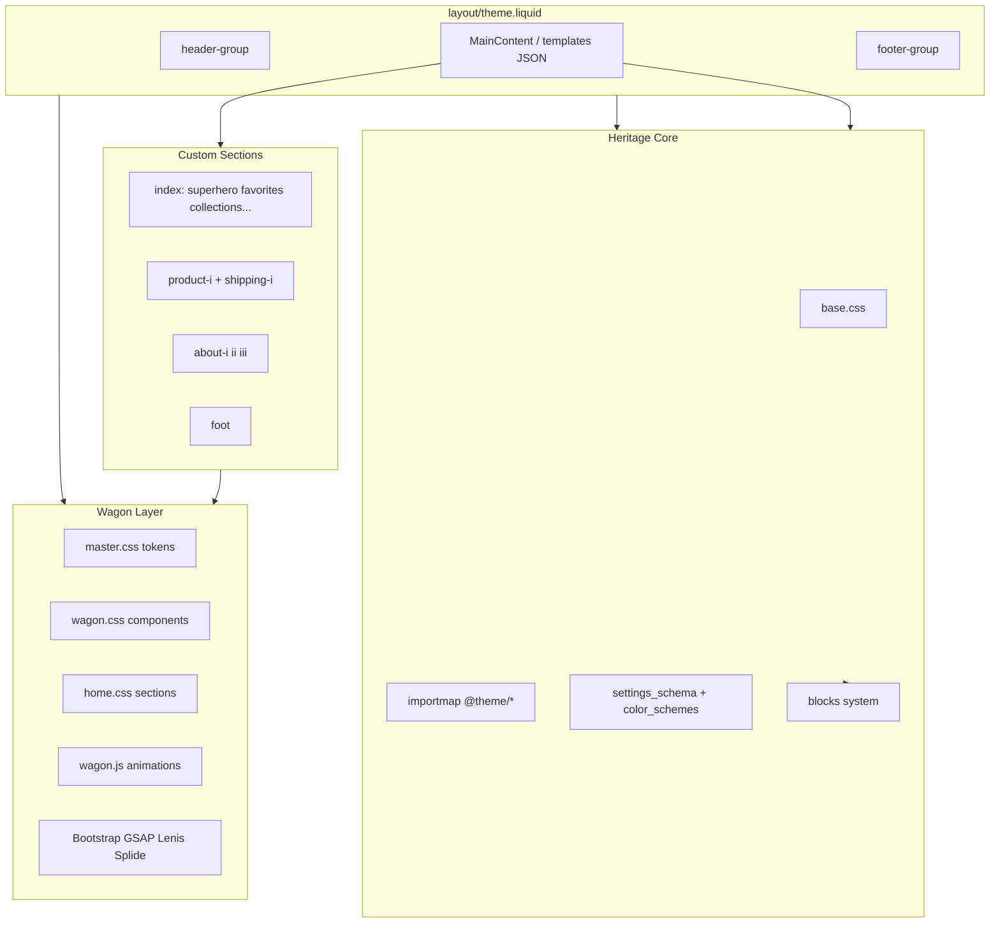

# Auditoría técnica — Devmon v1 (Heritage 3.5.1)

**Fecha:** 3 de julio de 2026  
**Alcance:** Solo lectura. Sin modificaciones a Liquid, CSS, JS ni JSON del theme.  
**Objetivo:** Evaluar el estado actual para convertirlo en un **starter theme limpio, reutilizable y escalable**, conservando la arquitectura funcional de Heritage.

---

## Resumen ejecutivo

Devmon v1 es **Heritage 3.5.1 de Shopify** con una capa de personalización significativa llamada **Wagon** (atribuida a codevamon en `master.css`). El theme en producción está orientado a la marca **Chocolat Uzma** (chocolatería en Chicago), no a “Devmon” — no hay referencias al nombre “devmon” en el código.

La personalización se concentra en:

| Capa | Rol |
|------|-----|
| **Heritage (base)** | Arquitectura OS 2.0: blocks, sections, importmap ES modules, color schemes, cart drawer, predictive search, etc. |
| **Wagon (custom)** | Sistema visual/UX: tipografía VW, paleta de marca, Bootstrap grid, animaciones GSAP/Lenis/Splitting, Splide |
| **Secciones `-i`** | Homepage, about, PDP y footer custom con contenido demo de la marca |

**Riesgo principal:** coexisten **dos stacks tecnológicos** (Heritage modular + jQuery/Bootstrap/CDN) cargados globalmente en `layout/theme.liquid`, lo que complica mantenimiento, performance y portabilidad como starter.

---

## 1. Estructura general del theme

### Inventario numérico

| Directorio | Cantidad | Notas |
|------------|----------|-------|
| `layout/` | 2 | `theme.liquid`, `password.liquid` |
| `templates/` | 16 | 15 JSON + 1 Liquid (`gift_card.liquid`) |
| `sections/` | 54 | ~15 custom + ~39 Heritage |
| `blocks/` | 93 | Sistema de bloques anidados Heritage |
| `snippets/` | 103 | Utilidades, estilos, componentes |
| `assets/` | 118 | 76 JS, 9 CSS, ~33 SVG/iconos |
| `config/` | 2 | `settings_schema.json`, `settings_data.json` |
| `locales/` | 51 | 25 idiomas + 26 `*.schema.json` |

### 1.1 Layout

#### `layout/theme.liquid` — **archivo crítico, altamente modificado**

Orden de carga:

1. Heritage: `meta-tags`, `stylesheets` (`base.css`), `fonts`, `scripts` (importmap + ES modules), `theme-styles-variables`, `color-schemes`
2. **CDN externos:** Bootstrap 5.3.3, Bootstrap Icons, Splide, Splitting, Adobe Typekit (`ldm7ibv`), Google Fonts (Inter, Inter Tight)
3. **Assets custom:** `splitting.css`, `splitting-cells.css`, `wagon.css`, `home.css`, `master.css`, `fonts.css`
4. **JS CDN:** jQuery 3.6, GSAP 3.12.5 + ScrollTrigger, Lenis 1.0.44, Splide, Splitting, Bootstrap bundle
5. **JS custom:** `wagon.js`

Estructura DOM:

- `#header-group` → ``
- `#MainContent` → `{{ content_for_layout }}`
- `<footer>` → ``
- Modales Heritage: `search-modal`, `quick-add-modal`

#### `layout/password.liquid`

Layout estándar Heritage para tienda con contraseña (sin la capa Wagon completa; verificar al limpiar).

---

### 1.2 Templates

| Template | Secciones principales | Observación |
|----------|----------------------|-------------|
| `index.json` | superhero, favorites-i, collections-i, marquee-i, reviews-i, visit-i, getintouch | **100% contenido demo Chocolat Uzma** |
| `product.json` | product-i, shipping-i, product-recommendations | PDP custom + bloques Heritage estáticos |
| `collection.json` | main-collection (modificado) | Usa estilos `shopping-i` vía main-collection |
| `page.about.json` | about-i, about-ii, about-iii | Biografía Uzma Sharif |
| `page.master.json` | master | Showcase del design system |
| `page.contact.json` | (Heritage/custom) | Contacto |
| `page.json` | main-page | Página genérica |
| `cart.json` | main-cart, product-list | Carrito Heritage |
| `search.json` | search-header, search-results | Búsqueda Heritage |
| `blog.json`, `article.json` | main-blog, main-blog-post | Blog Heritage |
| `list-collections.json` | main-collection-list | Heritage |
| `404.json`, `password.json` | main-404, password | Heritage |
| `gift_card.liquid` | Liquid legacy | Tarjeta regalo |

**Nota:** `sections/shopping-i.liquid` existe como sección independiente pero **no está referenciada en ningún template**; la PLP usa `main-collection.liquid` que replica su markup/clases.

---

### 1.3 Sections

#### Heritage (conservar arquitectura)

Ejemplos representativos: `header`, `footer`, `hero`, `slideshow`, `section`, `main-cart`, `main-collection`, `main-blog`, `product-information`, `product-recommendations`, `featured-product`, `predictive-search`, `search-results`, `layered-slideshow`, `media-with-content`, `carousel`, `marquee`, `divider`, `custom-liquid`, `password`, `quick-order-list`, etc.

#### Custom Wagon / marca (`*-i`, `foot`, `master`, `superhero`)

| Sección | Propósito |
|---------|-----------|
| `superhero` | Hero homepage con ornamentos SVG naranja `#FF791F` |
| `favorites-i` | Grid de productos favoritos (usa metafield `main_picture`) |
| `collections-i` | Carrusel/grid de colección estacional |
| `marquee-i` | Logos en marquee |
| `reviews-i` | Testimonios estáticos |
| `visit-i` | Mapa + dirección física Chicago |
| `getintouch` | Formulario contacto (``) |
| `about-i`, `about-ii`, `about-iii` | Página About con timeline |
| `product-i` | PDP custom (Splide gallery + bloques estáticos Heritage) |
| `shipping-i` | Cards de envío/devoluciones en PDP |
| `shopping-i` | PLP alternativa (**no usada en templates**) |
| `foot` | Footer custom (reemplaza `footer` Heritage en footer-group) |
| `master` | Guía visual de tipografía y botones |

#### Sections Heritage modificadas (alto riesgo)

| Archivo | Modificación |
|---------|--------------|
| `sections/header.liquid` | Minishop Splide, bigmenu Bootstrap, menú `linklists.navbar`, URLs CDN hardcodeadas, SVG stroke `#372223` |
| `sections/main-collection.liquid` | Markup `shopping-i`, filtros custom, icono CDN |
| `blocks/filters.liquid` | Estilos y clases Wagon integradas |
| `snippets/product-card.liquid` | Clase `product-card-shopping-i`, metafield `main_picture` |
| `snippets/header-drawer.liquid` | Imagen decorativa CDN |
| `snippets/header-actions.liquid` | SVG con stroke `#372223` |
| `snippets/sorting.liquid` | Icono filtro CDN |
| `snippets/quick-add-modal-styles.liquid` | `--color-ivory` |

---

### 1.4 Snippets

**Heritage core (no tocar sin revisión):**

- `scripts.liquid` — importmap `@theme/*`, carga condicional por template
- `theme-styles-variables.liquid` — variables CSS desde `settings`
- `color-schemes.liquid` — esquemas de color dinámicos
- `section.liquid`, `product-information-content.liquid`, `cart-*`, `predictive-search-*`, `media.liquid`, `price.liquid`, etc.

**Snippets con dependencia Wagon/marca:**

- `product-card.liquid` — metafield + clases shopping-i
- `card-gallery.liquid` — metafield `main_picture`
- Varios `*-styles.liquid` con tokens `--color-ivory`, etc.

---

### 1.5 Assets

#### CSS

| Archivo | Líneas (~) | Rol |
|---------|------------|-----|
| `base.css` | 4,191 | Heritage — sistema estructural principal |
| `wagon.css` | 3,235 | Header, menús, cart drawer, filtros, animaciones |
| `master.css` | 1,506 | Design tokens, tipografía VW, botones, formularios |
| `home.css` | 1,032 | Estilos por sección homepage/PLP |
| `fonts.css` | 74 | @font-face Turnkey Condensed (CDN tienda) |
| `splitting.css`, `splitting-cells.css` | — | Animación texto Splitting |
| `overflow-list.css`, `template-giftcard.css` | — | Heritage |

#### JavaScript

**Heritage (ES modules, `type="module"`):** ~70 archivos — `utilities.js`, `component.js`, `section-renderer.js`, `product-form.js`, `variant-picker.js`, `cart-drawer.js`, `predictive-search.js`, `facets.js`, etc.

**Wagon:** `wagon.js` (~786 líneas) — Lenis, GSAP ScrollTrigger, Splide, Splitting, animaciones de menú, marquee, acordeones.

**Dependencias CDN cargadas en todas las páginas:**

- jQuery 3.6.0
- Bootstrap 5.3.3 (CSS + JS)
- GSAP 3.12.5 + ScrollTrigger
- Lenis 1.0.44
- Splide 4.1.4
- Splitting 1.0.6
- Adobe Typekit `ldm7ibv`
- Google Fonts (Inter, Inter Tight)

---

### 1.6 Config

#### `config/settings_schema.json`

- `theme_info`: **Heritage 3.5.1**, autor Shopify
- Grupos Heritage completos: logo, color schemes, typography, layout, cart, badges, animations, etc.
- **No renombrado** a Devmon/starter

#### `config/settings_data.json`

Contenido sensible para limpieza:

- Logos: `shopify://shop_images/brand.svg`, `Logo.png`
- Fuentes theme editor: `instrument_sans_n4` (Heritage) — **desalineado** con fuentes Wagon reales
- **9 color schemes** con paleta Chocolat Uzma (`#202219`, `#f6eddd`, `#372223`, `#ffc80a`, etc.)
- Schemes con UUID custom (`scheme-0bb914f3-...`, `scheme-8ead3727-...`)
- Preset `"Heritage"` duplicando los mismos colores de marca

**Ausente en repo:** definiciones JSON de `header-group` y `footer-group`. El layout las referencia pero no hay `sections/header-group.json` ni equivalente en el filesystem. Probablemente viven solo en el admin de Shopify o en un pull incompleto.

---

### 1.7 Locales

- **51 archivos** — cobertura multilingüe Heritage estándar
- `en.default.json` + `en.default.schema.json` como base
- Traducciones de schemas (`*.schema.json`) para el theme editor
- **Sin strings custom** de marca Wagon en locales (textos hardcodeados en Liquid/schemas `default`)

---

## 2. Identidad visual específica

### 2.1 Colores hardcodeados

#### Tokens Wagon en `master.css` (`:root`)

```css
--color-chocolat: #372223;
--color-orange: #FF791F;
--color-tumeric: #FFC80A;
--color-dark-ivory: #F9EAD6;
--color-ivory: #FFF3E3;
--color-light-ivory: #FAF5EF;
--color-white: #FFFFFF;
```

#### Otros hardcodes

| Ubicación | Valor | Contexto |
|-----------|-------|----------|
| `superhero.liquid` (SVG inline) | `#FF791F` | Ornamentos decorativos |
| `header-actions.liquid`, `product-i.liquid` | `#372223` | Strokes SVG |
| `shipping-i.liquid` (blocks en product.json) | `#372223` | Iconos SVG inline |
| `master.css` `.range-shopping-i` | `#F9EAD6` | Track de slider precio |
| `base.css` | `#fff`, `#000` | Fallbacks puntuales Heritage |
| `settings_data.json` | Paleta completa marca | 9 schemes + preset |

**Conflicto:** Heritage usa `color_schemes` + variables `--color-*-rgb`. Wagon usa `--color-chocolat`, `--color-ivory`, etc. **Dos sistemas paralelos.**

---

### 2.2 Fuentes hardcodeadas

| Fuente | Origen | Uso |
|--------|--------|-----|
| **Turnkey Condensed** | `fonts.css` → CDN tienda `0658/2445/6946` | Headings (`.he-*`) en `master.css` |
| **stevie-sans** | Adobe Typekit `ldm7ibv.css` | Body, cart, menús en `wagon.css` / `master.css` |
| **obviously-narrow** | Typekit | Acentos en `wagon.css` |
| **Inter / Inter Tight** | Google Fonts | Fallbacks en `master.css` |
| **instrument_sans** | `settings_data.json` (Shopify font picker) | Heritage `theme-styles-variables` — **no es la fuente visual real** |

---

### 2.3 Nombres de marca

| Tipo | Ejemplos |
|------|----------|
| Marca | Chocolat Uzma, Uzma Sharif |
| Email | `info@chocolat-uzma.com` |
| Copyright | `© 2025 Chocolat Uzma. All rights reserved.` |
| Copy hero | `EXOTIC HANDCRAFTED CHOCOLATES INSPIRED BY OUR SOUTH ASIAN HERITAGE` |
| Copy urdu | `بماری پاکستانی ثقافت سے متاثر غیر ملکی چاکلیٹ` |
| Clases semánticas | `btn-chocolat`, `btn-tumeric`, `field-wagon`, `wagon-page-ready` |
| Sistema | Wagon (`wagon.css`, `wagon.js`), credit `github.com/codevamon` en `master.css` |

---

### 2.4 Imágenes demo

#### Referencias `shopify://shop_images/*` en templates

- `brand.svg`, `Logo.png` (settings)
- `picture_1.jpg`, múltiples PNG/SVG en index, about, reviews, marquee
- Colecciones hardcodeadas: `homepage`, `chocolate-bars`

#### CDN tienda hardcodeado (`0658/2445/6946`)

| Archivo | Asset |
|---------|-------|
| `fonts.css` | 9× Turnkey Condensed woff2 |
| `header.liquid` | `bg-menu-big.svg`, `bg-menu-drawer-2.svg`, `collection-all.jpg` |
| `header-drawer.liquid` | `bg-menu-drawer-2.svg` |
| `foot.liquid` | `detail-footer1.svg`, `superdetail-footer*.svg` |
| `main-collection.liquid`, `sorting.liquid` | `icon-filter.svg` |
| `product-i.liquid` | `mimidetail_1.svg` |

**Riesgo:** al clonar el starter en otra tienda, **todas estas URLs rompen**.

---

### 2.5 Textos específicos

Concentrados en:

- `templates/index.json` — homepage completa
- `templates/page.about.json` — biografía y timeline
- `templates/product.json` — acordeones Dimensions/Care/Shipping con políticas Chocolat Uzma (~2000+ palabras)
- Schemas `default` en: `superhero`, `about-ii`, `about-iii`, `reviews-i`, `foot`, `getintouch`
- `product-i.liquid` — breadcrumbs con "Home" hardcoded (no `t:`)

---

### 2.6 Links específicos

| Tipo | Ejemplo |
|------|---------|
| Dirección | 917 W. 18th Street, Suite 101, Chicago |
| Google Maps embed | Coordenadas tienda Chocolat Uzma |
| Menú | `linklists.navbar` (handle fijo, no setting) |
| Colecciones demo | `homepage`, `chocolate-bars`, `/collections/all` |
| Páginas | `shopify://pages/master` en CTAs del index |
| Redes | Facebook, Instagram, YouTube en schema `foot` |

---

### 2.7 Estilos demasiado personalizados

1. **Sistema tipográfico VW** (`master.css`) — tamaños en `vw` referenciados a 1440px; difícil de mapear a tokens Heritage
2. **Bootstrap grid** (`w-12`, `w-lg-6`, `d-none`, `d-md-block`) mezclado con grid Heritage
3. **Ornamentos SVG** inline masivos en `superhero.liquid` (~1000+ líneas de paths)
4. **Animaciones Splitting** por palabra en header (clase `wagon-page-ready`)
5. **Lenis smooth scroll** global (desactivado en touch, pero presente)
6. **Minishop Splide** en header atado a ítem de menú "shop"
7. **Clases utilitarias propias:** `he-xxl`, `bo-m`, `btn-i`, `container-i`, `flex-i`, `gap-i`

---

## 3. Qué debe conservarse

### 3.1 Arquitectura Liquid Heritage

- Sistema **sections → blocks → snippets** con ``
- Sections genéricas: `section.liquid`, `_blocks.liquid`
- Templates JSON con bloques estáticos (`"static": true`) — patrón product/cart/search
- `` / `` (una vez exportados los grupos)
- Liquid tags estándar: `routes`, `form`, `paginate`, `render`

### 3.2 Secciones reutilizables Heritage

Prioridad alta para un starter:

- **Commerce:** `main-cart`, `main-collection`, `product-information`, `product-recommendations`, `quick-order-list`
- **Catalog:** `featured-product`, `product-list`, `collection-list`
- **Content:** `hero`, `slideshow`, `media-with-content`, `layered-slideshow`, `featured-blog-posts`
- **Utility:** `custom-liquid`, `divider`, `search-header`, `search-results`, `predictive-search`
- **Layout:** `header` (base Heritage antes de custom), `footer`, `footer-utilities`, `header-announcements`

### 3.3 Secciones custom reutilizables (post-limpieza)

Con contenido neutralizado, estas secciones tienen valor como **patrones de starter**:

| Sección | Valor |
|---------|-------|
| `superhero` | Hero split con settings configurables |
| `favorites-i` / `collections-i` | Grids de producto/colección |
| `marquee-i` | Logo bar |
| `reviews-i` | Testimonios con blocks |
| `visit-i` | Ubicación + mapa embed |
| `getintouch` | Contacto |
| `shipping-i` | Info cards PDP |
| `master` | Documentación viva del DS |

Renombrar eventualmente (quitar sufijo `-i` y nombres de marca).

### 3.4 Snippets importantes

- `scripts.liquid`, `stylesheets.liquid`, `theme-styles-variables.liquid`, `color-schemes.liquid`
- `product-card.liquid`, `product-media-gallery-content.liquid`, `variant-main-picker.liquid`
- `cart-drawer` ecosystem: `cart-summary.liquid`, `cart-products.liquid`, `header-actions.liquid`
- `predictive-search-*`, `facets` support snippets
- `spacing-style.liquid`, `typography-style.liquid`, `gap-style.liquid` — utilidades de layout Heritage

### 3.5 JS funcional Heritage

Conservar el ecosistema `@theme/*`:

- **Core:** `component.js`, `utilities.js`, `events.js`, `morph.js`, `section-renderer.js`, `section-hydration.js`
- **Producto:** `product-form.js`, `variant-picker.js`, `media-gallery.js`, `sticky-add-to-cart.js`, `quick-add.js`
- **Cart:** `cart-drawer.js`, `component-cart-items.js`, `fly-to-cart.js`
- **Collection:** `facets.js`, `paginated-list.js`, `results-list.js`
- **UX:** `view-transitions.js`, `header.js`, `announcement-bar.js`, `dialog.js`

**Evaluar separadamente:** `wagon.js` — extraer utilidades genéricas (Splide init, debounce) vs. lógica de marca.

### 3.6 CSS estructural

- **`base.css`** — no reescribir; es el fundamento Heritage
- Variables y color schemes vía `theme-styles-variables.liquid` + `color-schemes.liquid`
- `overflow-list.css` — componente header Heritage

**Refactorizar, no eliminar de golpe:** `master.css` (tokens), `wagon.css` (componentes), `home.css` (secciones).

### 3.7 Schemas de secciones

- `settings_schema.json` completo — base del theme editor
- Schemas `` de blocks Heritage — contrato del theme editor
- Patrón `color_scheme`, `padding-block-*`, `spacing-style` en sections/blocks

### 3.8 Configuraciones base Shopify

- Color scheme groups en settings
- Cart drawer settings (`cart_type: drawer`, `auto_open_cart_drawer`)
- Quick add, variant buttons, page width
- Tipografía vía font picker (alinear con fuentes reales post-limpieza)
- Locales multilingües Heritage

---

## 4. Riesgos

### 4.1 Archivos que no se deben tocar sin cuidado

| Archivo | Motivo |
|---------|--------|
| `layout/theme.liquid` | Une Heritage + Wagon; romper carga rompe todo el sitio |
| `snippets/scripts.liquid` | Importmap y dependencias JS Heritage |
| `snippets/theme-styles-variables.liquid` | Genera todas las CSS variables del theme |
| `assets/base.css` | ~4200 líneas Heritage core |
| `assets/utilities.js`, `component.js` | Sincronizados con inline scripts del layout |
| `sections/product-i.liquid` | PDP híbrido: Splide + static blocks Heritage |
| `sections/header.liquid` | Menú, minishop, transparencia, sticky |
| `sections/main-collection.liquid` | PLP híbrida con facets Heritage |
| `blocks/filters.liquid` | Filtros storefront + estilos Wagon |
| `config/settings_schema.json` | Romper schema = theme editor roto |

### 4.2 Dependencias JS/CSS

```
┌─────────────────────────────────────────────────────────┐
│                    layout/theme.liquid                   │
├──────────────────────┬──────────────────────────────────┤
│   Heritage Stack     │         Wagon Stack               │
│   (ES modules)       │         (global CDN)              │
├──────────────────────┼──────────────────────────────────┤
│ base.css             │ bootstrap.css                     │
│ @theme/* modules     │ jquery.js                         │
│ view-transitions     │ gsap + ScrollTrigger              │
│ popover-polyfill     │ lenis                             │
│                      │ splide                            │
│                      │ splitting                         │
│                      │ bootstrap.bundle                  │
│                      │ wagon.js                          │
├──────────────────────┼──────────────────────────────────┤
│ instrument_sans      │ Turnkey, stevie-sans, obviously   │
│ (settings)           │ Inter (Typekit + Google)          │
└──────────────────────┴──────────────────────────────────┘
```

**Riesgos:**

- Doble manejo de scroll (Lenis vs nativo Heritage)
- jQuery solo por Bootstrap collapse — posible eliminación futura
- GSAP/Splitting en header afectan LCP/CLS
- 8+ requests CDN bloqueantes en `<head>`
- `theme-check-disable RemoteAsset` en layout — deuda técnica

### 4.3 Settings del theme

- `settings_data.json` mezcla preset Heritage con colores de cliente
- Fuentes en settings ≠ fuentes cargadas en layout
- Logos/favicon apuntan a assets de otra tienda
- `content_for_index: []` — homepage definida solo en `index.json` (correcto OS 2.0, pero fácil de confundir)

### 4.4 Integraciones Shopify CMS

| Integración | Estado |
|-------------|--------|
| **Online Store 2.0** | Templates JSON, section groups |
| **Theme blocks (`@theme`, `@app`)** | Soportado en `section.liquid`, `master.liquid` |
| **Shopify Forms** | `getintouch` usa `` nativo |
| **Accelerated checkout** | Bloque `accelerated-checkout` en product-i |
| **Shop Pay / Follow on Shop** | Bloques disponibles en footer Heritage |
| **Customer accounts** | `account-button` oculto en `wagon.css` (`display: none`) |
| **Reviews estándar** | `blocks/review.liquid` usa `product.metafields.reviews.*` con fallbacks demo |
| **Metaobjects** | No referenciados directamente |

### 4.5 Metafields y bloques dinámicos

| Metafield | Namespace | Archivos | Criticidad |
|-----------|-----------|----------|------------|
| `custom.main_picture` | product | `product-card.liquid`, `card-gallery.liquid`, `favorites-i.liquid`, `shopping-i.liquid` | **Alta** — sin él, cards pierden imagen alternativa y clase `darker` |
| `reviews.rating` | product | `blocks/review.liquid` | Media — app de reviews Shopify |
| `reviews.rating_count` | product | `blocks/review.liquid` | Media |

**Acción starter:** documentar `custom.main_picture` como metafield opcional o reemplazar por `featured_image` / metafield configurable en settings.

### 4.6 Otros riesgos

- **Section groups ausentes en repo** — header/footer pueden fallar en deploy limpio
- **Handle de menú `navbar`** hardcodeado en `header.liquid`
- **`linklists.navbar`** no existe en tiendas nuevas
- **Colecciones `homepage`, `chocolate-bars`** en index.json
- **Sección `foot` vs `footer`** — dos sistemas de footer coexisten
- **Typo CSS** en `wagon.css` línea 37: `!i;!;` — posible regla inválida
- **Account button oculto** — puede ser intencional de marca pero rompe UX estándar

---

## 5. Estrategia de limpieza por fases

### Fase 1 — Limpieza segura (sin cambiar arquitectura)

**Objetivo:** Starter funcional en tienda nueva sin contenido Chocolat Uzma.

| # | Tarea | Archivos |
|---|-------|----------|
| 1.1 | Neutralizar `templates/*.json`: textos, imágenes `shopify://`, colecciones, mapas, emails | `index.json`, `page.about.json`, `product.json`, etc. |
| 1.2 | Reemplazar `default` en schemas de secciones custom por placeholders genéricos | `superhero`, `foot`, `about-*`, `reviews-i`, `getintouch` |
| 1.3 | Resetear `settings_data.json`: logos blank, color schemes Heritage defaults, fuentes coherentes | `config/settings_data.json` |
| 1.4 | Sustituir URLs CDN `0658/2445/6946` por assets locales en `/assets` o settings `image_picker` | `fonts.css`, `header.liquid`, `foot.liquid`, etc. |
| 1.5 | Exportar y versionar `header-group.json` + `footer-group.json` desde Shopify CLI | `sections/` (crear) |
| 1.6 | Renombrar `theme_info` a nombre del starter (ej. "Devmon Starter") sin tocar schema structure | `settings_schema.json` |
| 1.7 | Eliminar o aislar `page.about.json` demo; mantener `page.master.json` como guía interna | `templates/` |
| 1.8 | Documentar metafield `custom.main_picture` como opcional con fallback | README/handoff |

**Criterio de éxito:** Theme sube a tienda development vacía, homepage renderiza con placeholders, PDP/cart/collection funcionan.

---

### Fase 2 — Variables visuales

**Objetivo:** Un solo sistema de tokens; eliminar colores/fuentes paralelos.

| # | Tarea | Detalle |
|---|-------|---------|
| 2.1 | Mapear tokens Wagon → Heritage color schemes | `--color-chocolat` → `scheme.settings.foreground` o CSS custom property derivada de `color-schemes` |
| 2.2 | Mover paleta de `master.css :root` a `settings_schema` o snippet de tokens | Mantener nombres semánticos (`--color-accent`) no de marca |
| 2.3 | Unificar fuentes: una fuente heading (Turnkey o alternativa libre), una body via font picker | Eliminar Typekit si no es requisito; self-host Turnkey en `/assets` |
| 2.4 | Reemplazar `stroke="#372223"` en SVGs por `currentColor` o `var(--color-foreground)` | `header-actions`, `product-i`, shipping cards |
| 2.5 | Renombrar clases `btn-chocolat` → `btn-primary-accent` (o similar) | `master.css`, `foot.liquid`, `filters.liquid` |
| 2.6 | Alinear `settings_data` fonts con layout (quitar Inter/Typekit redundantes o documentar) | `theme.liquid`, `settings_data.json` |
| 2.7 | Decidir: ¿Bootstrap permanente o migrar grid a CSS Heritage? | Impacto alto en todas las secciones `-i` |

**Criterio de éxito:** Cambiar color scheme en theme editor afecta Wagon + Heritage consistentemente.

---

### Fase 3 — Documentación

**Objetivo:** Starter usable por otro desarrollador sin contexto Chocolat Uzma.

Entregables sugeridos en `handoff/`:

| Doc | Contenido |
|-----|-----------|
| `02-architecture.md` | Diagrama Heritage + Wagon, orden de carga, section groups |
| `03-section-inventory.md` | Tabla Heritage vs custom vs modified |
| `04-design-tokens.md` | Tipografía VW, clases `he-*` / `bo-*` / `btn-*` |
| `05-metafields.md` | `custom.main_picture`, setup en admin |
| `06-dependencies.md` | CDN list, versiones, plan de reducción |
| `07-new-store-checklist.md` | Menús, colecciones, assets, metafields al instalar |

Incluir en README raíz:

- Requisitos: Shopify CLI, versión Heritage base
- Comandos: `shopify theme dev`, `shopify theme check`
- Cómo usar `page.master` como guía de estilos

---

### Fase 4 — QA

**Objetivo:** Regresión cero en flujos commerce.

#### Checklist funcional

- [ ] Homepage (todas las secciones `-i`)
- [ ] PLP / colección + filtros + sort + paginación
- [ ] PDP: galería Splide, variantes, add to cart, acordeones, recomendaciones
- [ ] Cart drawer: vacío, con items, descuentos, notas
- [ ] Quick add modal
- [ ] Búsqueda + predictive search
- [ ] Blog + artículo
- [ ] Páginas estáticas + contacto
- [ ] 404, password, gift card
- [ ] Header: minishop, drawer mobile, sticky, transparent
- [ ] Footer: newsletter, menús, redes

#### Checklist técnico

- [ ] `shopify theme check` sin errores críticos
- [ ] Lighthouse mobile: LCP, CLS (especialmente con Lenis/Splitting)
- [ ] Sin URLs CDN de tienda anterior
- [ ] Theme editor: todas las secciones custom editables
- [ ] Cambio de color scheme reflejado en Wagon
- [ ] Metafield `main_picture` con y sin valor
- [ ] Multi-idioma: strings `t:` en flows Heritage (custom aún tiene hardcodes)
- [ ] View transitions producto (si `transition_to_main_product` activo)

#### Checklist starter

- [ ] Deploy en tienda nueva < 30 min siguiendo checklist
- [ ] Sin referencias a Chocolat Uzma, Uzma, Chicago, emails reales
- [ ] `theme_info` con nombre/version del starter
- [ ] Section groups versionados en git

---

## Apéndice A — Mapa de arquitectura



---

## Apéndice B — Lista de secciones custom (`*-i` y afines)

```
about-i.liquid       about-ii.liquid      about-iii.liquid
collections-i.liquid favorites-i.liquid   getintouch.liquid
marquee-i.liquid     product-i.liquid     reviews-i.liquid
shipping-i.liquid    shopping-i.liquid*   visit-i.liquid
superhero.liquid     foot.liquid          master.liquid

* shopping-i.liquid no referenciada en templates; lógica en main-collection.liquid
```

---

## Apéndice C — Paleta de marca actual (settings_data)

| Token | Hex | Uso típico |
|-------|-----|------------|
| Background oscuro | `#202219` | scheme-1 |
| Crema / ivory | `#f6eddd`, `#fff3e3`, `#faf5ef` | Texto, fondos |
| Chocolat | `#372223` | Texto, bordes, acentos |
| Tumeric | `#ffc80a` | Acento highlight (scheme-8ead…) |
| Naranja | `#FF791F` | Ornamentos SVG |
| Verde oliva | `#46493c`, `#635d4e` | schemes 3–4 |

---

## Conclusión

Devmon v1 **no es un starter limpio hoy**: es Heritage 3.5.1 con una implementación de cliente (Chocolat Uzma) bien estructurada en la capa Wagon, pero con **contenido demo, assets de tienda externa, dos sistemas de diseño y dependencias CDN globales**.

La conversión a starter viable se logra **sin borrar estructura funcional** si se:

1. Preserva Heritage (blocks, JS modules, `base.css`, commerce sections)
2. Generaliza Wagon (tokens, secciones `-i`, `master` como documentación)
3. Elimina identidad de marca en templates/settings de forma sistemática
4. Resuelve metafields, section groups y menú `navbar` como configuración, no hardcode

**Próximo paso recomendado:** ejecutar Fase 1 con un branch dedicado, empezando por `settings_data.json`, `templates/index.json` y extracción de assets CDN a `/assets`.

---

*Generado por auditoría estática del repositorio. No se modificó ningún archivo del theme.*
