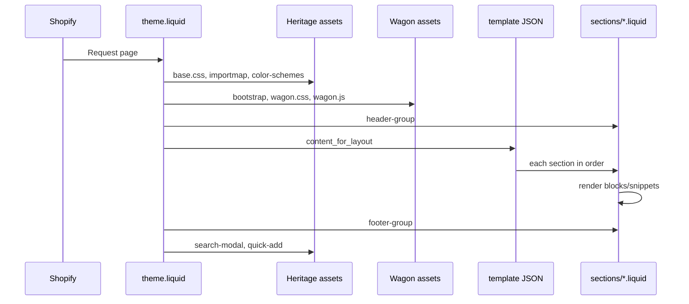

# Devmon v1 — Arquitectura del theme

**Fase:** 0.5 (documentación)  
**Base:** Shopify Heritage 3.5.1  
**Capa custom:** Wagon (codevamon)  
**Fuente:** Auditoría `01-devmon-v1-theme-audit.md` + inspección del repositorio

---

## 1. Visión general

Devmon v1 es un theme **Online Store 2.0** con dos capas superpuestas:

```
┌─────────────────────────────────────────────────────────────┐
│                     layout/theme.liquid                      │
├──────────────────────────┬──────────────────────────────────┤
│     CAPA HERITAGE        │         CAPA WAGON               │
│  (Shopify, modular)      │  (Design system + UX custom)     │
├──────────────────────────┼──────────────────────────────────┤
│ base.css                 │ master.css (tokens)              │
│ importmap @theme/*       │ wagon.css (componentes)          │
│ ES modules (~70 JS)      │ home.css (secciones)             │
│ color_schemes (settings) │ fonts.css (Turnkey)              │
│ blocks / sections OS 2.0 │ wagon.js                         │
│ snippets core            │ Bootstrap + CDN (GSAP, etc.)     │
└──────────────────────────┴──────────────────────────────────┘
```

**Principio de diseño Heritage:** composición por **templates JSON → sections → blocks → snippets**, con JavaScript modular vía `importmap` y custom elements.

**Principio de diseño Wagon:** capa visual transversal (tipografía VW, paleta de marca, grid Bootstrap, animaciones) inyectada globalmente desde el layout y aplicada mediante clases utilitarias (`he-*`, `bo-*`, `btn-i`, `container-i`, etc.).

---

## 2. Orden de carga del theme

### 2.1 `<head>` — secuencia en `layout/theme.liquid`

| Orden | Recurso | Capa | Rol |
|-------|---------|------|-----|
| 1 | Favicon (settings) | Heritage | Icono desde theme settings |
| 2 | `rel="expect"` → `#MainContent` | Heritage | View transitions (condicional) |
| 3 | `snippets/meta-tags.liquid` | Heritage | SEO, OG, canonical |
| 4 | `snippets/stylesheets.liquid` | Heritage | Preload `overflow-list.css` + **`base.css`** |
| 5 | `snippets/fonts.liquid` | Heritage | Font faces desde Shopify font picker |
| 6 | `snippets/scripts.liquid` | Heritage | **importmap**, modulepreloads, scripts condicionales |
| 7 | `snippets/theme-styles-variables.liquid` | Heritage | Variables CSS desde `settings` |
| 8 | `snippets/color-schemes.liquid` | Heritage | Clases `.color-scheme-*` dinámicas |
| 9 | Bootstrap 5.3.3 CSS | Wagon CDN | Grid, utilities, collapse |
| 10 | Bootstrap Icons | Wagon CDN | Iconos en secciones custom |
| 11 | Splide core CSS | Wagon CDN | Carruseles header/PDP |
| 12 | `splitting.css`, `splitting-cells.css` | Wagon asset | Animación texto |
| 13 | Adobe Typekit `ldm7ibv` | Wagon CDN | stevie-sans, obviously-narrow |
| 14 | Google Fonts (Inter, Inter Tight) | Wagon CDN | Fallbacks tipográficos |
| 15 | `wagon.css` | Wagon | Componentes globales |
| 16 | `home.css` | Wagon | Estilos por sección homepage/PLP |
| 17 | `master.css` | Wagon | Tokens + tipografía + botones |
| 18 | `fonts.css` | Wagon | Turnkey Condensed (CDN tienda) |
| 19 | `theme-editor` (design mode) | Heritage | Solo en editor |
| 20 | `{{ content_for_header }}` | Shopify | Apps, analytics, Shop |
| 21 | jQuery 3.6 | Wagon CDN | Dependencia Bootstrap collapse |
| 22 | GSAP + ScrollTrigger | Wagon CDN | Animaciones |
| 23 | Lenis | Wagon CDN | Smooth scroll (desktop) |
| 24 | Splide JS | Wagon CDN | Carruseles |
| 25 | Splitting JS | Wagon CDN | Texto animado |
| 26 | Bootstrap bundle | Wagon CDN | Collapse, drawer |
| 27 | `wagon.js` | Wagon | Orquestación Wagon |

> **Nota:** `theme-check-disable RemoteAsset` envuelve los CDN en el layout. Heritage por sí solo evita la mayoría de assets remotos; Wagon los introduce de forma global.

### 2.2 `<body>` — estructura DOM

```
body
├── skip-to-content-link (snippet)
├── #header-group
│   └──      ← header, header-announcements, etc.
├── <script> inline                       ← header height CSS vars (sync utilities.js)
├── #MainContent.content-for-layout
│   └── {{ content_for_layout }}          ← template JSON activo
├── <footer>
│   └──      ← foot / footer, footer-utilities
├── search-modal (snippet)
└── quick-add-modal (snippet, condicional)
```

### 2.3 `layout/password.liquid` — carga reducida

Solo Heritage: `stylesheets`, `fonts`, `scripts`, `theme-styles-variables`, `color-schemes`. **Sin capa Wagon completa** (sin Bootstrap, wagon.css, wagon.js). Footer usa `` directo, no `footer-group`.

**Pendiente de verificación:** si `password.liquid` debe alinearse con Wagon en fases futuras.

---

## 3. Rol de `layout/theme.liquid`

Es el **punto de integración** entre Heritage y Wagon. Responsabilidades:

1. **Orquestar carga de assets** — orden fijo; cambiar orden puede romper cascada CSS o inicialización JS.
2. **Montar section groups** — `header-group` y `footer-group` envuelven el contenido de cada página.
3. **Inline scripts de header** — calculan `--header-height`, `--header-group-height`, `--transparent-header-offset-boolean`, `data-menu-style`. Deben mantenerse sincronizados con `assets/utilities.js` y `assets/header.js` (comentario en el propio layout).
4. **Modales globales** — search y quick-add fuera del flujo de templates.
5. **Atributos de transición** — `data-page-transition-enabled`, `data-product-transition` en `#MainContent`.

**Riesgo de modificación:** **ALTO**. Cualquier cambio afecta todas las páginas y ambas capas.

---

## 4. Rol de templates JSON

Los templates en `templates/*.json` definen **qué sections se renderizan** en cada ruta de la tienda.

### Patrón OS 2.0

```json
{
  "sections": {
    "section_id": {
      "type": "nombre-seccion",
      "blocks": { ... },
      "block_order": [ ... ],
      "settings": { ... }
    }
  },
  "order": ["section_id", ...]
}
```

### Templates del repositorio

| Template | Sections de nivel superior |
|----------|---------------------------|
| `index.json` | superhero, favorites-i, collections-i, marquee-i, reviews-i, visit-i, getintouch |
| `product.json` | product-i, shipping-i, product-recommendations |
| `collection.json` | main-collection |
| `page.about.json` | about-i, about-ii, about-iii |
| `page.master.json`, `page.json` | master |
| `page.contact.json` | main-page, section (contact-form) |
| `cart.json` | main-cart, product-list |
| `search.json` | search-header, search-results |
| `blog.json` | main-blog |
| `article.json` | main-blog-post |
| `list-collections.json` | main-collection-list |
| `404.json` | main-404, product-list |
| `password.json` | password |

`gift_card.liquid` es template Liquid legacy (no JSON).

### Bloques estáticos

En templates como `product.json`, `cart.json`, `collection.json`, los blocks llevan `"static": true`. Son **contratos fijos** entre template y section: la section espera esos block IDs. Cambiar tipos o IDs rompe el theme editor y el render.

**Riesgo:** modificar templates sin entender blocks estáticos = **ALTO** en PDP, cart y collection.

---

## 5. Rol de sections

Las sections son **unidades de página** registradas en `sections/*.liquid` con schema JSON al final.

### Tipos funcionales

| Tipo | Ejemplos | Comportamiento |
|------|----------|----------------|
| **Main / template-bound** | `main-cart`, `main-collection`, `main-blog` | Atados a un template; schema puede restringir `"templates": ["collection"]` |
| **Section groups** | `header`, `foot`, `header-announcements` | Montados vía `` — **no en templates JSON** |
| **Composable (theme editor)** | `section`, `hero`, `slideshow` | Añadibles por merchant; tienen `presets` |
| **Wagon custom** | `superhero`, `product-i`, `favorites-i` | Markup + clases Wagon; settings con defaults de marca |
| **Runtime / API** | `predictive-search`, `predictive-search-empty`, `section-rendering-product-card` | Invocados por AJAX o Section Rendering API |

### Section groups (pendiente de verificación)

El layout referencia `header-group` y `footer-group`, pero **no existen archivos `sections/header-group.json` ni `sections/footer-group.json` en el repositorio**. La composición real (p. ej. `header` + `header-announcements`, `foot` vs `footer`) debe confirmarse con:

```bash
shopify theme pull --only config
# o export desde Theme Editor → header/footer groups
```

---

## 6. Rol de snippets

Snippets en `snippets/*.liquid` son **parciales reutilizables** invocados con ``.

### Categorías

| Categoría | Ejemplos | Capa |
|-----------|----------|------|
| **Infraestructura** | `scripts`, `stylesheets`, `theme-styles-variables`, `color-schemes`, `meta-tags` | Heritage core |
| **Layout / spacing** | `spacing-style`, `gap-style`, `typography-style`, `section` | Heritage |
| **Commerce** | `product-card`, `price`, `cart-summary`, `variant-main-picker`, `quick-add` | Heritage (+ modificaciones Wagon en algunos) |
| **Estilos encapsulados** | `*-styles.liquid` (buy-buttons, slideshow, predictive-search) | Heritage / mixto |
| **Wagon-dependent** | Uso de clases `container-i`, tokens `--color-ivory` en estilos | Mixto |

Los snippets **no tienen schema** propio; sus parámetros se documentan con `` (Heritage reciente) o comentarios.

---

## 7. Rol de blocks

Los blocks viven en `blocks/*.liquid` y se anidan dentro de sections via `` o definiciones en el schema de la section.

### Convenciones de nombres

| Prefijo | Significado |
|---------|-------------|
| `_nombre` | Block interno/privado (ej. `_product-card`, `_cart-summary`) |
| Sin prefijo | Block público añadible en editor (ej. `text`, `button`, `image`) |

### Relación section ↔ blocks

- **Sections main-*** definen blocks estáticos en el template JSON.
- **Sections composables** (`section.liquid`, `footer.liquid`) exponen `"blocks": [{ "type": "@theme" }, { "type": "@app" }]`.
- **product-i** embebe blocks Heritage (`variant-picker`, `buy-buttons`) como estáticos en `product.json`.

**Riesgo:** eliminar o renombrar un block rompe todas las sections y templates que lo referencian.

---

## 8. Rol de assets

### CSS

| Archivo | Capa | Función |
|---------|------|---------|
| `base.css` | Heritage | Sistema visual completo del theme base (~4.2k líneas) |
| `overflow-list.css` | Heritage | Menú overflow en header |
| `wagon.css` | Wagon | Header, menús, cart, filtros, animaciones (~3.2k líneas) |
| `master.css` | Wagon | Tokens `:root`, tipografía VW, botones, forms (~1.5k líneas) |
| `home.css` | Wagon | Secciones homepage y PLP (~1k líneas) |
| `fonts.css` | Wagon | @font-face Turnkey |
| `splitting*.css` | Wagon | Plugin Splitting |
| `template-giftcard.css` | Heritage | Gift card |

### JavaScript Heritage (`assets/*.js`)

- **Arquitectura:** custom elements + módulos ES (`component.js` base).
- **Import map** en `scripts.liquid` alias `@theme/*` → archivos en `assets/`.
- **Hidratación:** `section-renderer.js`, `section-hydration.js`, `morph.js` para actualizaciones parciales.
- **No usar jQuery** en módulos Heritage; coexisten en paralelo con Wagon.

### JavaScript Wagon

- `wagon.js` — inicialización Lenis, GSAP, Splide, Splitting, listeners de menú/acordeón.
- Depende de globals CDN cargados antes en el layout.

### SVG / iconos

`assets/icon-*.svg` — iconografía Heritage. Algunos iconos custom están en CDN externo (filtros, decoración).

---

## 9. Heritage vs Wagon — diferencias

| Dimensión | Heritage | Wagon |
|-----------|----------|-------|
| **Origen** | Shopify 3.5.1 | Custom (codevamon) |
| **CSS principal** | `base.css` + variables de settings | `master.css`, `wagon.css`, `home.css` |
| **Colores** | `color_schemes` en theme settings | Tokens `--color-chocolat`, `--color-ivory`, etc. |
| **Tipografía** | Font picker → `theme-styles-variables` | Turnkey, Typekit, Inter; clases `he-*` / `bo-*` |
| **Grid / layout** | CSS propio + variables | Bootstrap 5 (`w-12`, `d-md-none`, etc.) |
| **JS** | ES modules, importmap | jQuery, GSAP, Lenis, Splide, `wagon.js` |
| **Sections** | `main-*`, `section`, `hero`, etc. | `*-i`, `superhero`, `foot`, `master` |
| **Extensibilidad** | Blocks, `@app`, metafields estándar | Metafield `custom.main_picture`, menú `navbar` hardcodeado |
| **Theme editor** | Schemas `t:` completos | Schemas con defaults en inglés/marca |
| **Performance** | Modulepreload, carga condicional | Muchos CDN globales en cada página |

### Regla de frontera

- **Lógica commerce** (cart, variants, facets, search) → Heritage.
- **Presentación de marca y marketing** → Wagon.
- **Zona gris (modificada):** `header.liquid`, `main-collection.liquid`, `product-card.liquid`, `filters.liquid` — Heritage por dentro, Wagon por fuera.

---

## 10. Riesgos al tocar cada capa

### Capa Heritage

| Acción | Riesgo |
|--------|--------|
| Editar `base.css` | **Alto** — regresiones globales en todo el theme |
| Editar `scripts.liquid` / importmap | **Alto** — rompe módulos JS |
| Cambiar schemas de blocks main-* | **Alto** — rompe templates JSON |
| Actualizar versión Heritage | **Alto** — conflictos con overrides Wagon |
| Tocar `utilities.js` sin sync layout | **Medio** — header height / transparent offset |

### Capa Wagon

| Acción | Riesgo |
|--------|--------|
| Editar `master.css` tokens | **Medio** — afecta todas las secciones `-i` |
| Editar `wagon.css` | **Alto** — header, cart, filtros, menús |
| Editar `wagon.js` | **Alto** — animaciones y carruseles |
| Añadir CDN en layout | **Medio** — performance y CSP |
| Eliminar Bootstrap sin migrar markup | **Alto** — grid roto en ~15 sections |

### Capa datos (config / templates)

| Acción | Riesgo |
|--------|--------|
| `settings_data.json` a ciegas | **Alto** — identidad + fonts + schemes |
| Templates JSON sin backup | **Medio** — contenido demo perdido (deseable en Fase 1) |

---

## 11. Archivos core — no tocar sin revisión

### Críticos (Heritage)

```
layout/theme.liquid          ← integración dual (revisión obligatoria)
snippets/scripts.liquid      ← importmap @theme/*
snippets/theme-styles-variables.liquid
snippets/color-schemes.liquid
snippets/stylesheets.liquid
assets/base.css
assets/component.js
assets/utilities.js
assets/section-renderer.js
assets/product-form.js
assets/variant-picker.js
assets/cart-drawer.js
config/settings_schema.json
```

### Críticos (Wagon + híbridos)

```
layout/theme.liquid          ← CDN + orden de carga
assets/wagon.js
assets/wagon.css
assets/master.css
sections/header.liquid
sections/main-collection.liquid
sections/product-i.liquid
blocks/filters.liquid
snippets/product-card.liquid
```

### Sensibles a identidad (Fase 1+)

```
config/settings_data.json
templates/index.json
templates/page.about.json
templates/product.json
sections/foot.liquid
```

---

## 12. Flujo de renderizado (resumen)



---

## 13. Pendientes de verificación

| Item | Acción recomendada |
|------|-------------------|
| Composición exacta de `header-group` / `footer-group` | `shopify theme pull` o inspección en admin |
| ¿`footer.liquid` Heritage sigue en grupo o solo `foot`? | Verificar en Theme Editor |
| ¿`password.liquid` debe cargar Wagon? | Decisión de producto Fase 4–5 |
| Versión exacta de Heritage vs upstream Shopify | Diff con release 3.5.1 oficial |
| `page.json` apunta a `master` — ¿intencional? | Confirmar con equipo |

---

*Documento generado en Fase 0.5. No modifica archivos del theme.*
