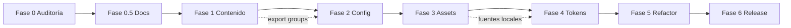

# Devmon v1 — Roadmap definitivo

**Fase:** 0.5 (documentación)  
**Objetivo final:** Starter theme **Devmon v1.0** — limpio, escalable, basado en Heritage 3.5.1 + capa Wagon generalizada  
**Documentos relacionados:** `01` auditoría · `02` arquitectura · `03` reglas · `04` inventario · `05` riesgos

---

## Vista general

```
Fase 0 ──► Fase 0.5 ──► Fase 1 ──► Fase 2 ──► Fase 3 ──► Fase 4 ──► Fase 5 ──► Fase 6
Auditoría   Docs         Contenido   Config      CDN/       Tokens     Refactor    Release
                          marca       hardcodes   assets     diseño     JS/CSS      v1.0
```

---

## Fase 0 — Auditoría inicial

| Campo | Detalle |
|-------|---------|
| **Estado** | ✅ Completada |
| **Objetivo** | Entender estado del theme, identidad de marca, riesgos y arquitectura sin modificar código. |
| **Qué se puede tocar** | Solo `handoff/01-devmon-v1-theme-audit.md` |
| **Qué NO se puede tocar** | Todo el theme (Liquid, CSS, JS, JSON, config, assets) |
| **Criterio de éxito** | Reporte técnico completo con estructura, identidad visual, conservar/riesgos, estrategia inicial |
| **Riesgo principal** | Decisiones de limpieza sin datos → mitigado por auditoría |

**Entregable:** `handoff/01-devmon-v1-theme-audit.md`

---

## Fase 0.5 — Documentación de arquitectura

| Campo | Detalle |
|-------|---------|
| **Estado** | ✅ En curso / completada con este paquete |
| **Objetivo** | Base documental para que cualquier desarrollador trabaje sin contexto previo del cliente. |
| **Qué se puede tocar** | Solo archivos nuevos en `handoff/` (`02`–`06`) |
| **Qué NO se puede tocar** | Theme completo |
| **Criterio de éxito** | Arquitectura, reglas, inventario de sections, mapa de riesgos y roadmap alineados con auditoría |
| **Riesgo principal** | Documentación desactualizada → mitigar con referencias a archivos y pendientes de verificación |

**Entregables:**
- `handoff/02-devmon-v1-architecture.md`
- `handoff/03-devmon-v1-development-rules.md`
- `handoff/04-devmon-v1-section-inventory.md`
- `handoff/05-devmon-v1-risk-map.md`
- `handoff/06-devmon-v1-roadmap.md`

---

## Fase 1 — Neutralización de contenido de marca

| Campo | Detalle |
|-------|---------|
| **Objetivo** | Eliminar rastros de Chocolat Uzma y demo content; theme instalable en tienda vacía con placeholders neutros. |
| **Qué se puede tocar** | `templates/*.json`, `default` en schemas de sections Wagon (textos), `config/settings_data.json` (logos blank, schemes neutros), `theme_info` en `settings_schema.json`, export/versionar section groups JSON |
| **Qué NO se puede tocar** | `base.css`, `scripts.liquid`, importmap, estructura de blocks estáticos en templates, `wagon.js`, CDN en layout, lógica metafield, eliminación de sections |
| **Criterio de éxito** | `rg -i "uzma|chocolat|chicago|0658/2445"` sin hits en templates/settings; homepage y about renderizan placeholders; PDP/cart/collection funcionan; section groups en repo |
| **Riesgo principal** | Romper referencias `color_scheme` UUID en templates al resetear `settings_data` — mapear schemes antes de borrar |

**Riesgos abordados:** R-07, R-08, R-09, R-13, R-14, parcial R-03 y R-15

---

## Fase 2 — Configuración y hardcodes

| Campo | Detalle |
|-------|---------|
| **Objetivo** | Convertir hardcodes de configuración en settings de theme/section; tienda nueva no requiere menú `navbar` ni metafields no documentados. |
| **Qué se puede tocar** | Schemas: añadir `link_list` para menú en `header.liquid`, settings de footer, documentar metafields; `settings_schema.json` (añadir settings, no romper ids); locales para strings `t:` en sections Wagon |
| **Qué NO se puede tocar** | `base.css`, orden de carga layout, eliminar Bootstrap, refactor masivo de `header.liquid` markup |
| **Criterio de éxito** | Header funciona con menú elegido en theme settings; `custom.main_picture` documentado con fallback verificado; account button decisión explícita (mostrar/ocultar via setting) |
| **Riesgo principal** | Regresión en minishop Splide al cambiar lógica de detección menú "shop" |

**Riesgos abordados:** R-05, R-06, R-11

---

## Fase 3 — Assets y dependencias externas

| Campo | Detalle |
|-------|---------|
| **Objetivo** | Eliminar dependencia de CDN de tienda ajena; reducir y controlar CDN públicos; self-host donde sea viable. |
| **Qué se puede tocar** | `assets/` (añadir woff2, svg), `fonts.css`, URLs en sections/snippets, evaluar mover Bootstrap/Splide a assets, `layout/theme.liquid` URLs |
| **Qué NO se puede tocar** | Lógica Heritage JS, estructura importmap, eliminar Splide/GSAP sin reemplazo en `wagon.js` |
| **Criterio de éxito** | Cero URLs `0658/2445/6946`; fuentes críticas en `/assets`; inventario de CDN con versiones fijadas; theme funciona en tienda sin apps externas |
| **Riesgo principal** | Licencia fuentes Turnkey al self-host; tamaño del repo |

**Riesgos abordados:** R-02, R-03, R-04, inicio R-12

---

## Fase 4 — Tokens visuales y sistema de diseño

| Campo | Detalle |
|-------|---------|
| **Objetivo** | Unificar paleta y tipografía: un sistema de tokens; theme editor controla colores del storefront Wagon + Heritage. |
| **Qué se puede tocar** | `master.css` (`:root`), `home.css`, `wagon.css` (mapeo a variables Heritage), SVG `currentColor`, renombrar clases `btn-chocolat` → semánticas, `color-schemes` integration |
| **Qué NO se puede tocar** | `base.css` salvo puente mínimo documentado, schemas structure, blocks commerce |
| **Criterio de éxito** | Cambiar scheme-1 en admin actualiza header, homepage y PDP de forma coherente; documento `04-design-tokens` (futuro); `master` section refleja tokens reales |
| **Riesgo principal** | Regresiones visuales masivas en ~6k líneas CSS Wagon — requiere checklist visual por template |

**Riesgos abordados:** R-10, parcial R-03

---

## Fase 5 — Refactor JS/CSS

| Campo | Detalle |
|-------|---------|
| **Objetivo** | Reducir deuda dual-stack; simplificar dependencias; alinear PLP/PDP con patrones mantenibles. |
| **Qué se puede tocar** | `wagon.js`, `wagon.css`, `header.liquid`, `main-collection.liquid`, `product-i.liquid`, `blocks/filters.liquid`, evaluar eliminar jQuery, migrar Bootstrap grid, convergencia `product-information` vs `product-i`, typo `wagon.css` |
| **Qué NO se puede tocar** | Contratos de `product-form.js`, `variant-picker.js`, `cart-drawer.js`, importmap aliases sin migración completa |
| **Criterio de éxito** | Menos globals CDN; scroll único; `shopping-i.liquid` eliminada o fusionada documentalmente; Lighthouse mejora vs baseline; sin regresiones commerce |
| **Riesgo principal** | Romper cart drawer, facets o variant picker — QA exhaustivo obligatorio |

**Riesgos abordados:** R-01, R-12, R-15, R-16, R-17

---

## Fase 6 — QA completo y release v1.0

| Campo | Detalle |
|-------|---------|
| **Objetivo** | Publicar **Devmon Starter v1.0** listo para clonar, con documentación, checklist de instalación y calidad verificada. |
| **Qué se puede tocar** | `theme_info` final, README raíz, changelog, ajustes menores de bugs encontrados en QA |
| **Qué NO se puede tocar** | Features nuevas no planificadas; refactors grandes (congelar scope) |
| **Criterio de éxito** | Checklist QA completo (ver abajo); `shopify theme check` limpio; install en tienda nueva < 30 min; tag git `v1.0.0`; cero marca cliente |
| **Riesgo principal** | Publicar con section groups o metafields no documentados |

**Riesgos cerrados:** todos los R-01–R-17 verificados o aceptados como limitaciones documentadas

---

## Checklist QA Fase 6 (referencia)

### Funcional
- [ ] Homepage (secciones Wagon)
- [ ] PLP: filtros, sort, paginación, infinite scroll
- [ ] PDP: galería, variantes, add to cart, acordeones, recomendaciones
- [ ] Cart drawer + cart page
- [ ] Quick add
- [ ] Search + predictive search
- [ ] Blog + artículo
- [ ] Páginas + contacto
- [ ] 404, password, gift card
- [ ] Header: drawer, minishop, sticky, transparent
- [ ] Footer: newsletter, links

### Técnico
- [ ] `shopify theme check`
- [ ] Lighthouse mobile (baseline documentado)
- [ ] Theme Editor sin errores JSON
- [ ] Color scheme switch coherente
- [ ] Metafield `main_picture` con/sin valor
- [ ] Nueva tienda: menú + colecciones placeholder

### Starter
- [ ] README install
- [ ] `handoff/` completo
- [ ] Sin CDN tienda ajena
- [ ] `theme_name` = Devmon (o nombre final)

---

## Dependencias entre fases



**Regla:** no saltar a Fase 5 sin completar Fase 1 (contenido) y Fase 3 (assets críticos), salvo hotfix acordado.

---

## Pendientes de verificación (globales)

| Item | Fase que lo resuelve |
|------|---------------------|
| Composición exacta header-group / footer-group | Fase 1 |
| ¿`page.json` debe usar `master` o `main-page`? | Fase 1 |
| Licencia redistribución Turnkey Condensed | Fase 3 |
| ¿Mantener Typekit o solo self-hosted? | Fase 3–4 |
| Nombre final del starter en Shopify admin | Fase 6 |

---

## Control de cambios por fase

| Fase | Archivos típicos en diff | Tamaño PR orientativo |
|------|--------------------------|------------------------|
| 0.5 | `handoff/*.md` | N/A |
| 1 | `templates/`, `settings_data.json`, schemas defaults | Medio |
| 2 | `sections/header.liquid` schema, locales, docs metafield | Medio |
| 3 | `assets/`, `fonts.css`, URLs en liquid | Grande |
| 4 | `master.css`, `wagon.css`, `home.css` | Grande |
| 5 | `wagon.js`, `header.liquid`, `product-i.liquid` | Muy grande — subdividir |
| 6 | README, fixes menores | Pequeño |

---

*Roadmap generado en Fase 0.5. Revisar al completar cada fase.*
