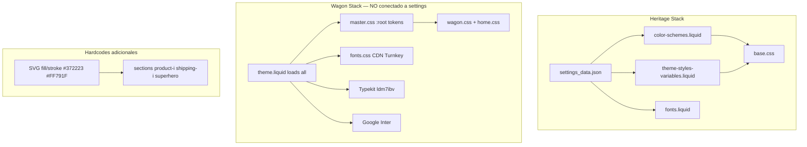

# Fase 2C.1 — Auditoría profunda de fuentes y colores

**Proyecto:** Devmon v1 (Heritage 3.5.1 + Wagon)  
**Fecha:** 2026-07-03  
**Alcance:** Solo lectura. Cero modificaciones al theme.  
**Objetivo:** Mapear dónde viven colores, tokens, fuentes y dependencias tipográficas para convertir Devmon v1 en un starter theme visualmente neutro, claro y reusable.

---

## Resumen ejecutivo

Devmon v1 opera con **dos sistemas visuales paralelos e independientes**:

| Sistema | Fuente de verdad | Consumidores | Configurable en theme editor |
|---------|------------------|--------------|----------------------------|
| **Heritage** | `config/settings_data.json` → `snippets/color-schemes.liquid` | `base.css`, blocks Heritage, cart, drawer | Sí — Color schemes + font pickers |
| **Wagon** | `assets/master.css` `:root` | `wagon.css`, `home.css`, sections `-i`, utilidades `.he-*` / `.bo-*` | **No** — tokens hardcodeados |

Las fuentes siguen el mismo patrón dual:

| Stack | Carga | Familias activas en Wagon | Configurable |
|-------|-------|---------------------------|--------------|
| **Heritage** | `snippets/fonts.liquid` + `theme-styles-variables.liquid` | No usadas por clases Wagon | Sí — `type_body_font`, `type_heading_font`, etc. |
| **Wagon externo** | `layout/theme.liquid` | Typekit `stevie-sans`, `obviously-narrow`; Google Inter | No |
| **Wagon CDN tienda** | `assets/fonts.css` | Turnkey Condensed (9 pesos) | No — CDN `0658/2445/6946` |

**Conclusión:** Cambiar fonts/colors en Theme Settings **no afecta** el storefront Wagon (homepage, header custom, PDP, PLP, footer). Neutralizar visualmente requiere tocar la capa Wagon de forma ordenada.

---

## Arquitectura actual (diagrama)



---

## 1. Tabla de colores encontrados

### 1.1 Tokens raíz Wagon (`assets/master.css` :root, L27–33)

| Token | Valor hex | Rol semántico actual | Refs en `assets/*.css` | Archivos adicionales |
|-------|-----------|----------------------|------------------------|----------------------|
| `--color-chocolat` | `#372223` | Texto, bordes, fondos oscuros, thumb range | **93** | `sections/product-i.liquid` (10), `sections/shipping-i.liquid` (2), `snippets/*` SVG |
| `--color-orange` | `#FF791F` | Acento CTA, borders focus, variant swatches | **10** | — |
| `--color-tumeric` | `#FFC80A` | Highlight amarillo, badges, botones `.btn-tumeric` | **8** | `sections/shipping-i.liquid` (1) |
| `--color-dark-ivory` | `#F9EAD6` | Track range slider | **2** (+5 hex directo en `master.css`) | — |
| `--color-ivory` | `#FFF3E3` | Fondos superficie cálida | **30** | `snippets/quick-add-modal-styles.liquid` (1) |
| `--color-light-ivory` | `#FAF5EF` | Texto sobre botones oscuros | **9** | — |
| `--color-white` | `#FFFFFF` | Blanco explícito | 1 | — |

### 1.2 Hex hardcodeados (fuera de tokens)

| Color | Valor | Ocurrencias totales | Ubicaciones principales |
|-------|-------|---------------------|-------------------------|
| Marrón marca | `#372223` | **15** | `master.css` (1 def), `wagon.css` (`#37222342` alpha border), `product-i`, `foot`, `visit-i`, `header-actions`, `header-drawer`, `templates/product.json` (SVG shipping icons) |
| Naranja acento | `#FF791F` | **41** | `master.css` (3 en range slider), **`sections/superhero.liquid` (38 paths SVG ornament)** |
| Amarillo | `#FFC80A` | **1** | Solo definición token en `master.css` |
| Ivory | `#FFF3E3` | **2** | `master.css`, `sections/collections-i.liquid` (1 SVG path) |
| Light ivory | `#FAF5EF` | **1** | Solo `master.css` |
| Dark ivory | `#F9EAD6` | **5** | `master.css` (range slider track) |
| Otros Wagon | `#F2272B` | 1 | `wagon.css` — error/sale color puntual |
| Overlay | `#000000d4` | 1 | `home.css` — gradient hero |

### 1.3 Clases de botón acopladas a tokens de marca

| Clase | Refs totales | Usada en sections |
|-------|--------------|-------------------|
| `.btn-chocolat` | **8** | `foot.liquid`, `blocks/filters.liquid` + definición `master.css` |
| `.btn-tumeric` | **17** | `superhero`, `favorites-i`, `collections-i`, `getintouch` |
| `.btn-ivory` | **8** | `collections-i` |
| `.btn-orange` | **0** | Solo CSS, no usada en markup |

### 1.4 Color schemes Heritage (`config/settings_data.json`)

| Scheme ID | Background | Foreground heading | Origen | Referenciado en |
|-----------|------------|-------------------|--------|-----------------|
| `scheme-1` | `#202219` | `#f6eddd` | Heritage preset (oscuro) | `page.contact.json`, `cart.json`, `search.json`, `404.json` |
| `scheme-2` | `#ffffff` | `#000000` | Heritage preset | — |
| `scheme-3` | `#46493c` | `#f6eddd` | Heritage preset | `cart.json`, `404.json` |
| `scheme-4` | `#635d4e` | `#f6eddd` | Heritage preset | — |
| `scheme-5` | `#000000` | `#ffffff` | Heritage preset | — |
| `scheme-6` | transparent | `#000000` | Heritage preset | — |
| **`scheme-0bb914f3…`** | **`#fff3e3`** | **`#372223`** | **Cliente** | `drawer_color_scheme` global |
| **`scheme-8ead3727…`** | **`#ffc80a`** | **`#372223`** | **Cliente** | `header-group.json` → `color_scheme_top` |
| **`scheme-7115b6b1…`** | **`#faf5ef`** | **`#372223`** | **Cliente** | `templates/product.json` → product recommendations |

**Riesgo UUID:** Si se resetean schemes en 2C.6 sin remapear templates, header amarillo y drawer crema dejarán de aplicar estilo (o quedarán huérfanos).

### 1.5 Colores inline en SVG (sections/snippets)

| Archivo | Colores inline | Cantidad aprox. | Impacto |
|---------|----------------|-----------------|---------|
| `sections/superhero.liquid` | `#FF791F` (ornamentos), paths decorativos complejos | 38 fills naranja | Hero visual fuertemente ligado a marca |
| `sections/foot.liquid` | `#372223` | 2 paths | Divider decorativo footer |
| `sections/visit-i.liquid` | `#372223` | 2 paths | Divider decorativo |
| `sections/product-i.liquid` | `#372223` | 2 paths | Breadcrumb chevron |
| `sections/collections-i.liquid` | `#FFF3E3` | 1 path | Divider (invertido sobre fondo oscuro) |
| `snippets/header-actions.liquid` | `#372223` stroke | 4 paths | Iconos carrito/cuenta mobile |
| `snippets/header-drawer.liquid` | `#372223` stroke | 3 paths | Hamburger icon |
| `templates/product.json` | `#372223` fill en SVG shipping cards | 4+ icons embebidos | Cards shipping PDP |

### 1.6 `assets/base.css` — referencias relevantes

Heritage **no usa tokens Wagon**. Usa variables generadas por `color-schemes.liquid`:

- `--color-background`, `--color-foreground`, `--color-primary`, etc.
- `#fff` puntual en L1600 (utility)
- `#000` en focus ring L3511

**No requiere cambio** para neutralización Wagon; sí revisar en 2C.6 si schemes Heritage se resetean a palette clara.

### 1.7 `assets/home.css` — resumen

- **35** refs a `var(--color-chocolat)`
- **Múltiples** refs a `var(--color-ivory)`, `var(--color-tumeric)`
- 1 gradient `#000000d4`
- **0** `font-family` hardcodeados — depende de tokens + clases `.he-*`/`.bo-*` en `master.css`

Secciones afectadas visualmente: about, reviews, visit, getintouch, favorites, collections (homepage stack).

---

## 2. Tabla de fuentes encontradas

### 2.1 Fuentes hardcodeadas en CSS Wagon

| Familia | Definición | Refs | Archivo(s) | Clases afectadas |
|---------|------------|------|------------|------------------|
| **Turnkey Condensed** | `@font-face` ×9 vía CDN tienda | **11** | `fonts.css`, `master.css` | `.he-xxl`, `.he-xl`, `.he-s`, `.he-xs`, `.he-xxs`, `.number-i` |
| **stevie-sans** | Adobe Typekit `ldm7ibv` | **16** | `master.css`, `wagon.css` | `.he-l`, `.he-m`, `.bo-*` (xxl→xxs), `.btn-*`, cart/checkout Wagon |
| **obviously-narrow** | Typekit | **1** | `wagon.css` L99 | Clase acento estrecho (header/marquee context) |
| **inter** (lowercase) | Google Fonts Inter | **1** | `master.css` L200 | `.sp-i` (special text) |
| **Inter / Inter Tight** | Google Fonts link | **2** refs en layout | `layout/theme.liquid` L56 | Cargadas pero **casi no referenciadas** en CSS Wagon |

### 2.2 Shopify font picker (Heritage — funcional pero desconectado de Wagon)

| Setting | Valor actual (`settings_data.json`) | Genera variable | Usado por Wagon |
|---------|-------------------------------------|-----------------|-----------------|
| `type_body_font` | `instrument_sans_n4` | `--font-body--family` | **No** |
| `type_subheading_font` | `instrument_sans_n4` | `--font-subheading--family` | **No** |
| `type_heading_font` | `instrument_sans_n4` | `--font-heading--family` | **No** |
| `type_accent_font` | `instrument_sans_n4` | `--font-accent--family` | **No** |
| `type_font_h1` | `secondary` | `--font-h1--family` | **No** (solo Heritage headings) |

**Pipeline Heritage (correcto, no tocar estructura):**

1. `config/settings_schema.json` — 4× `font_picker`
2. `snippets/fonts.liquid` — preload woff2 Shopify CDN
3. `snippets/theme-styles-variables.liquid` — `@font-face` + `--font-*--family`
4. `assets/base.css` — consume `--font-paragraph--family`, `--font-h1--family`, etc.

### 2.3 Dependencias externas visuales (fuentes)

| Dependencia | URL / origen | Archivo carga | Pesos/archivos | Eliminar en |
|-------------|--------------|---------------|----------------|-------------|
| **Turnkey Condensed** | CDN `0658/2445/6946` ×9 woff2 | `fonts.css` ← `theme.liquid` L62 | 100–900 | **2C.5** |
| **Adobe Typekit** | `use.typekit.net/ldm7ibv.css` | `theme.liquid` L50–52 | stevie-sans, obviously-narrow | **2C.5** |
| **Google Fonts** | Inter + Inter Tight | `theme.liquid` L54–56 | Variable | **2C.5** |
| **Instrument Sans** | Shopify font CDN | Heritage pipeline | n4 | Mantener — estándar Shopify |

### 2.4 Mapa clase tipográfica Wagon → fuente actual

| Clase utilitaria | Fuente hardcodeada | Uso típico |
|------------------|-------------------|------------|
| `.he-xxl` … `.he-xs` | Turnkey Condensed | Headings display homepage/sections |
| `.he-l`, `.he-m` | stevie-sans | Subheadings |
| `.bo-xxl` … `.bo-xxxs` | stevie-sans | Body copy Wagon |
| `.sp-i` | inter | Texto especial |
| `.number-i` | Turnkey Condensed | Números/stats |
| `.btn-i`, `.btn-ii` | stevie-sans | Botones Wagon |

---

## 3. Archivos afectados (inventario consolidado)

### 3.1 Colores — por capa

| Capa | Archivos | Riesgo cambio |
|------|----------|---------------|
| **Tokens raíz** | `assets/master.css` | **Alto** — punto único de verdad Wagon |
| **Consumo masivo** | `assets/wagon.css` (~84 token refs) | **Alto** — regresiones visuales globales |
| **Homepage** | `assets/home.css` (~35 chocolat refs) | **Medio** — scope homepage sections |
| **Sections scoped CSS** | `product-i.liquid`, `shipping-i.liquid` | **Medio** — PDP + shipping cards |
| **SVG inline** | `superhero.liquid`, `foot.liquid`, `visit-i.liquid`, `product-i.liquid`, `collections-i.liquid`, `header-actions.liquid`, `header-drawer.liquid` | **Medio-Alto** — requiere edición manual path-by-path o `currentColor` |
| **Templates JSON** | `product.json` (scheme UUID + SVG fills), `header-group.json` (scheme UUID) | **Medio** — remapear al resetear schemes |
| **Config** | `settings_data.json` (3 schemes cliente + drawer) | **Alto** — coordinar con 2C.6 |
| **Snippets** | `quick-add-modal-styles.liquid` | **Bajo** |

### 3.2 Fuentes — por capa

| Capa | Archivos | Riesgo cambio |
|------|----------|---------------|
| **Definición CDN** | `assets/fonts.css` | **Alto** — eliminar/reemplazar en 2C.5 |
| **Clases tipográficas** | `assets/master.css` L151–205, L250–253 | **Alto** — corazón del sistema `.he-*`/`.bo-*` |
| **Overrides puntuales** | `assets/wagon.css` (7× stevie-sans) | **Medio** |
| **Carga externa** | `layout/theme.liquid` L50–56, L62 | **Alto** — 3 stacks paralelos |
| **Heritage (no tocar)** | `snippets/fonts.liquid`, `theme-styles-variables.liquid`, `base.css` | **Bajo** si solo se redirigen consumidores Wagon |

---

## 4. Riesgos por archivo

| Archivo | Riesgo | Detalle |
|---------|--------|---------|
| `assets/master.css` | **Crítico** | Define todos los tokens Wagon + tipografía + botones + range slider hex. Contiene carácter suelto `+` en L198 (posible error CSS). |
| `assets/wagon.css` | **Crítico** | ~3200 líneas; 93 refs `--color-chocolat`; mezcla tokens + hex alpha `#37222342`. |
| `assets/home.css` | **Alto** | Toda la homepage Wagon depende de tokens marca. |
| `assets/fonts.css` | **Alto** | Archivo completo = CDN tienda ajena; eliminar sin reemplazo rompe headings. |
| `layout/theme.liquid` | **Alto** | Orden carga: Heritage fonts → Bootstrap → Typekit → Google → wagon CSS → fonts.css. |
| `sections/superhero.liquid` | **Alto** | 38 SVG paths `#FF791F`; cambio masivo o simplificación decoración. |
| `config/settings_data.json` | **Alto** | 3 UUID schemes con `#372223`; `drawer_color_scheme` apunta a scheme cliente. |
| `sections/header-group.json` | **Medio** | `color_scheme_top: scheme-8ead3727…` (header amarillo). |
| `templates/product.json` | **Medio** | `scheme-7115b6b1…` en recommendations; SVG icons `#372223`. |
| `sections/product-i.liquid` | **Medio** | Scoped CSS chocolat + breadcrumb SVG + depende tipografía Wagon. |
| `snippets/header-actions.liquid` | **Medio** | Stroke hardcodeado no sigue color scheme. |
| `snippets/color-schemes.liquid` | **Bajo** | No modificar lógica; solo datos en settings_data. |
| `assets/base.css` | **Bajo** | Heritage; solo afectado si se resetean schemes globales. |

---

## 5. Propuesta de paleta neutral (starter theme)

Objetivo: fondo claro, acento azul profesional, sin calidez chocolate/amarillo del cliente.

### 5.1 Tokens Wagon propuestos (`master.css` :root)

| Token propuesto | Hex sugerido | Reemplaza | Uso |
|-----------------|--------------|-----------|-----|
| `--color-primary` | `#1E293B` | `--color-chocolat` | Texto principal, bordes fuertes, thumbs |
| `--color-accent` | `#4A6FA5` | `--color-orange` | CTAs, focus rings, acentos interactivos |
| `--color-highlight` | `#93C5FD` | `--color-tumeric` | Badges/highlights opcionales (o eliminar) |
| `--color-surface` | `#FFFFFF` | `--color-ivory` | Fondos de cards/sections |
| `--color-surface-muted` | `#EEF4FB` | `--color-dark-ivory` | Fondos alternos azul pastel suave |
| `--color-surface-alt` | `#F8FAFC` | `--color-light-ivory` | Superficies secundarias |
| `--color-border` | `#E2E8F0` | (nuevo) | Bordes suaves, dividers CSS |
| `--color-white` | `#FFFFFF` | `--color-white` | Sin cambio |

### 5.2 Color schemes Heritage propuestos (reset 2C.6)

| Scheme | Background | Foreground | Primary | Uso sugerido |
|--------|------------|------------|---------|--------------|
| `scheme-1` | `#FFFFFF` | `#1E293B` | `#1E293B` | Default storefront claro |
| `scheme-2` | `#EEF4FB` | `#1E293B` | `#4A6FA5` | Secciones alternas azul pastel |
| `scheme-3` | `#1E293B` | `#FFFFFF` | `#FFFFFF` | Contraste oscuro (footer/header opcional) |
| Eliminar UUID | — | — | — | Migrar refs a scheme-1/2/3 |

### 5.3 Mapeo de clases botón (rename opcional Fase 4+)

| Actual | Propuesto | Notas |
|--------|-----------|-------|
| `.btn-chocolat` | `.btn-primary` | Mantener alias temporal durante migración |
| `.btn-tumeric` | `.btn-accent` | CTAs amarillos → azul accent |
| `.btn-ivory` | `.btn-surface` | Outline sobre fondo claro |

---

## 6. Propuesta de fuentes estándar Shopify

### 6.1 Principio

**Una sola fuente body + una heading**, controladas desde Theme Settings, consumidas por Wagon vía variables Heritage ya existentes.

### 6.2 Mapeo propuesto (2C.3)

```css
/* master.css — reemplazo de hardcodes */
.he-xxl, .he-xl, .he-l, .he-m, .he-s, .he-xs, .he-xxs,
.he-xxl *, .he-xl *, /* ... */ {
  font-family: var(--font-heading--family);
  font-style: var(--font-heading--style);
  font-weight: var(--font-heading--weight);
}

.bo-xxl, .bo-xl, .bo-l, .bo-m, .bo-s, .bo-xs, .bo-xxs,
.bo-xxl *, /* ... */ {
  font-family: var(--font-body--family);
  font-style: var(--font-body--style);
  font-weight: var(--font-body--weight);
}

.btn-i, .btn-ii, .btn-iii,
.btn-i *, .btn-ii *, .btn-iii * {
  font-family: var(--font-body--family);
}

.sp-i, .sp-i * {
  font-family: var(--font-accent--family, var(--font-body--family));
}

.number-i {
  font-family: var(--font-heading--family);
}
```

### 6.3 Defaults recomendados (`settings_data.json`)

| Setting | Valor starter sugerido | Notas |
|---------|------------------------|-------|
| `type_body_font` | `instrument_sans_n4` | Mantener — sans moderna, Shopify-hosted |
| `type_heading_font` | `instrument_sans_n5` o misma family weight 600 | Consistencia; evitar segunda fuente externa |
| `type_subheading_font` | = body | Simplificar |
| `type_accent_font` | = body | Eliminar necesidad Typekit |

### 6.4 Eliminaciones posteriores (2C.5)

| Eliminar | Cuando |
|----------|--------|
| `assets/fonts.css` del layout | Tras 2C.3 verificado — Turnkey sin referencias |
| Typekit `<link>` ×3 | Idem — stevie-sans sin referencias |
| Google Fonts `<link>` ×3 | Idem — inter/sp-i migrado |
| Archivo `fonts.css` | Opcional delete en Fase 3 assets |

---

## 7. Plan de ejecución (fases pequeñas)

### Fase 2C.2 — Tokens raíz en `master.css`

**Alcance:** Solo `:root` tokens + range slider hex en `master.css`.  
**Acción:** Renombrar tokens (`--color-chocolat` → `--color-primary`, etc.) con **aliases temporales** para no romper wagon.css/home.css de golpe:

```css
--color-primary: #1E293B;
--color-chocolat: var(--color-primary); /* alias deprecado — remover en 2C.2b */
```

**Archivos:** `assets/master.css`  
**Riesgo:** Medio — slider PLP cambia color inmediatamente.  
**Verificación:** PLP range filter, botones `.btn-*`, master section styleguide.

---

### Fase 2C.3 — Font-family → variables Shopify

**Alcance:** `master.css` clases `.he-*`, `.bo-*`, `.btn-*`, `.sp-i`, `.number-i`; overrides en `wagon.css`.  
**Acción:** Reemplazar Turnkey/stevie-sans/inter por `var(--font-heading--family)` / `var(--font-body--family)`.  
**Archivos:** `assets/master.css`, `assets/wagon.css` (7 refs)  
**Riesgo:** Alto visual — todo el storefront Wagon cambia tipografía.  
**Verificación:** Homepage, header, PDP, footer, cart drawer Wagon styles.

---

### Fase 2C.4 — SVG inline colors

**Alcance:** Sections/snippets con `fill="#372223"`, `fill="#FF791F"`, `stroke="#372223"`.  
**Acción preferida:** `fill="currentColor"` / `stroke="currentColor"` + `color: var(--color-primary)` en contenedor padre.  
**Archivos:**

- `sections/superhero.liquid` (38 paths — considerar simplificar ornament o CSS filter)
- `sections/foot.liquid`, `visit-i.liquid`, `product-i.liquid`, `collections-i.liquid`
- `snippets/header-actions.liquid`, `header-drawer.liquid`
- `templates/product.json` (SVG embebidos en shipping cards)

**Riesgo:** Medio — decoración hero más sensible.  
**Verificación:** Iconos header mobile, dividers, shipping icons PDP.

---

### Fase 2C.5 — Remover imports externos de fuentes

**Alcance:** `layout/theme.liquid` Typekit + Google Fonts links; tag `fonts.css`.  
**Precondición:** 2C.3 completo + grep cero refs Turnkey/stevie-sans/obviously-narrow/inter.  
**Archivos:** `layout/theme.liquid`, opcional delete `assets/fonts.css`  
**Riesgo:** Bajo si precondición cumplida.  
**Verificación:** Network tab — solo Shopify font CDN + Heritage preloads.

---

### Fase 2C.6 — Reset `settings_data` color schemes

**Alcance:** `config/settings_data.json` — eliminar/reemplazar 3 UUID schemes cliente; remapear refs.  
**Acción:**

1. Crear schemes neutros scheme-1/2/3 (tabla §5.2)
2. Remapear `drawer_color_scheme` → `scheme-1`
3. Remapear `header-group.json` `color_scheme_top` → `scheme-1` o `scheme-2`
4. Remapear `product.json` recommendations → `scheme-1`
5. Eliminar UUID schemes huérfanos

**Archivos:** `settings_data.json`, `header-group.json`, `templates/product.json`, cualquier template con UUID  
**Riesgo:** **Alto** — header pierde amarillo, drawer pierde crema, posibles refs rotas.  
**Verificación:** Theme editor color schemes; header/cart drawer/PDP recommendations.

---

## 8. Orden recomendado de cambios

```
2C.2 tokens raíz (aliases)
    ↓
2C.3 font-family → Shopify vars
    ↓
2C.4 SVG currentColor
    ↓
2C.5 quitar Typekit/Google/fonts.css
    ↓
2C.6 reset color schemes + remapear JSON
    ↓
(limpieza) remover aliases --color-chocolat en wagon.css/home.css
    ↓
(opcional Fase 4) renombrar .btn-chocolat → .btn-primary en markup
```

**Paralelizable con cuidado:** 2C.4 puede iniciarse tras 2C.2 (SVG no depende de fuentes).  
**No paralelizar:** 2C.5 antes de 2C.3; 2C.6 antes de confirmar palette en 2C.2.

---

## 9. Qué NO tocar todavía

| Área | Motivo |
|------|--------|
| `assets/base.css` | Heritage core; funciona con color-schemes.liquid |
| `snippets/color-schemes.liquid` | Lógica correcta; solo cambian datos en settings |
| `snippets/theme-styles-variables.liquid` | Pipeline font picker estándar — consumidores Wagon se conectan en 2C.3 |
| `snippets/scripts.liquid` / importmap | Stack JS Heritage |
| `layout/password.liquid` | No carga Wagon fonts/CSS — ya neutral |
| CDN Bootstrap/GSAP/Splide en `theme.liquid` | Fase 3 assets, no visual tokens |
| Clases Bootstrap (`d-none`, `w-12`, grid) | Fase 5 refactor |
| `wagon.js` animaciones | No afecta colors/fonts directamente |
| Contenido/copy (Fase 1 completada) | Fuera de scope 2C |
| URLs CDN imagen `0658/2445/6946` | Fase 3 assets |

---

## 10. Comandos de verificación

```bash
cd /Users/sublime/codevamon/dev/browser/shopify-themes/devmon-v1

# Tokens marca
rg "color-chocolat|color-orange|color-tumeric|color-ivory|btn-chocolat|btn-tumeric" assets/ sections/ blocks/

# Hex marca
rg -i "#372223|#FF791F|#FFC80A|#FFF3E3|#FAF5EF|#F9EAD6" assets/ sections/ snippets/ templates/

# Fuentes hardcodeadas
rg "Turnkey|stevie-sans|obviously-narrow|font-family:'inter'" assets/ layout/

# Dependencias externas fuentes
rg "typekit|fonts\.googleapis|fonts\.css" layout/ assets/

# Schemes UUID cliente
rg "scheme-[0-9a-f-]{36}" config/ sections/ templates/

# Post-2C.3: confirmar cero refs externas
rg "Turnkey|stevie-sans|obviously|typekit" --glob '!handoff/**'
```

---

## 11. Métricas de referencia (baseline pre-cambio)

| Métrica | Valor |
|---------|-------|
| `--color-chocolat` en assets | 93 |
| `--color-orange` en assets | 10 |
| `--color-tumeric` en assets | 8 |
| `--color-ivory` en assets | 30 |
| `#372223` total codebase | 15 |
| `#FF791F` total codebase | 41 |
| Fuentes externas cargadas en layout | 3 (Typekit, Google, fonts.css) |
| `@font-face` CDN tienda | 9 |
| Font pickers Shopify activos pero ignorados por Wagon | 4 |
| Color schemes con identidad cliente | 3 UUID |
| Stacks tipográficos simultáneos en página | **4** (Instrument Sans + Turnkey + Typekit + Google) |

---

## 12. Notas metodológicas

- Auditoría ejecutada sobre working tree post-Fase 1 y post-Fase 2A.
- `assets/home.css` no define fuentes propias; hereda de clases `master.css`.
- Heritage color schemes (`scheme-1` oscuro `#202219`) coexisten con Wagon claro ivory — **inconsistencia visual intencional del cliente** a resolver en 2C.6.
- El carácter `+` suelto en `master.css` L198 debería corregirse en 2C.2 (no es parte de esta auditoría).
- Cambiar solo Theme Settings **sin 2C.2–2C.3** no neutraliza el storefront Wagon.

---

## Siguiente paso recomendado

**Fase 2C.2** — Reemplazar tokens `:root` en `master.css` con palette neutral + aliases temporales hacia nombres legacy, verificando PLP range slider y botones antes de propagar a `wagon.css`/`home.css`.
