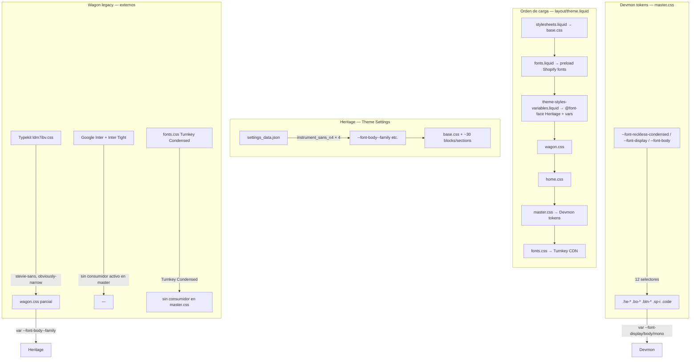

# Fase 2C.4A — Auditoría: sistema de fuentes escalable Devmon

**Fecha:** 2026-07-03  
**Alcance:** Solo lectura y documentación. Cero modificaciones al theme.  
**Objetivo:** Diseñar una arquitectura donde Devmon use tokens tipográficos estables (`--font-reckless-condensed`, `--font-display`, etc.) mientras la fuente real pueda intercambiarse entre local, Adobe Typekit, Google Fonts o fallback del sistema — sin tocar componentes.

---

## Resumen ejecutivo

Devmon v1 opera hoy con **cuatro sistemas tipográficos paralelos** que no comparten la misma capa de tokens. Los tokens Devmon en `master.css` (Fase 2C.3) están definidos pero **no tienen `@font-face` ni proveedor conectado**; las fuentes que realmente cargan son Heritage (Instrument Sans), Typekit (`stevie-sans`, `obviously-narrow`), Google (Inter) y Turnkey Condensed vía CDN ajeno (`fonts.css`).

La arquitectura propuesta separa **Proveedor → Tokens base → Aliases → Componentes**. Cambiar de local a Typekit implica editar solo 1–2 archivos de infraestructura; los selectores `.he-*`, `.bo-*` y similares permanecen intactos.

---

## 1. Estado actual de fuentes

### 1.1 Mapa de sistemas en paralelo



### 1.2 Inventario por archivo

| Archivo | Rol actual | Familias / variables | Estado |
|---------|------------|----------------------|--------|
| `assets/master.css` L57–68 | **Tokens Devmon (consumo)** | `--font-reckless-condensed`, `--font-pp-mori`, `--font-ibm-plex-mono` + aliases `--font-display/heading/body/mono` | Definidos; **sin carga de fuente** |
| `assets/master.css` L173–289 | Consumidores Wagon | `.he-*` → `--font-display`; `.bo-*`, `.btn-*` → `--font-body`; `.sp-i`, `.code` → `--font-mono` | ✅ Conectado a tokens Devmon |
| `assets/wagon.css` | Consumidores Wagon (parcial) | 8× `var(--font-body--family)`; 1× `var(--font-accent--family)` | ❌ Sigue en vars **Heritage**, no Devmon |
| `assets/home.css` | Consumidores tipográficos | Solo tamaños vía clases `.he-*`/`.bo-*`; sin `font-family` directa | ✅ Hereda de `master.css` |
| `assets/fonts.css` | **Proveedor @font-face** | 9 pesos de `'Turnkey Condensed'` | CDN tienda origen `0658/2445/6946`; **nombre no coincide** con tokens Devmon |
| `layout/theme.liquid` L30–32, L50–62 | **Orquestación de carga** | Heritage preload + Typekit + Google + wagon/home/master/fonts.css | 4 proveedores simultáneos |
| `snippets/fonts.liquid` | Preload Heritage | `settings.type_*_font` → Shopify CDN | Solo Heritage |
| `snippets/theme-styles-variables.liquid` L45–122, L158–169 | @font-face + vars Heritage | `--font-body--family`, `--font-heading--family`, etc. | Generado desde Theme Settings |
| `config/settings_data.json` | Valores actuales | `type_body_font`, `type_subheading_font`, `type_heading_font`, `type_accent_font` → **`instrument_sans_n4`** (todos iguales) | Heritage unificado en Instrument Sans |
| `config/settings_schema.json` L354–377 | Schema font pickers | 4× `font_picker`; defaults: Work Sans / Anonymous Pro | Configurable en editor; **no afecta Wagon Devmon** |
| `assets/` (binarios) | Fuentes locales | **0 archivos** `.woff2`/`.woff`/`.ttf`/`.otf` | Sin fuentes locales en theme |

### 1.3 Proveedores externos activos

| Proveedor | URL / origen | Familias servidas | Consumidor actual |
|-----------|--------------|-------------------|-------------------|
| **Shopify Font Library** | Via `fonts.liquid` + `theme-styles-variables.liquid` | Instrument Sans (config actual) | Heritage `base.css`, blocks, `wagon.css` (vars `--font-body--*`) |
| **Adobe Typekit** | `https://use.typekit.net/ldm7ibv.css` | `stevie-sans`, `obviously-narrow` (kit Chocolat Uzma) | Potencial en drawer vía `--font-accent--*`; ya no referenciado en `master.css` |
| **Google Fonts** | Inter + Inter Tight | `Inter`, `Inter Tight` | **Ninguno** en CSS activo post-2C.3 |
| **CDN Shopify ajeno** | `fonts.css` → store `0658/2445/6946` | Turnkey Condensed (9 pesos) | **Ninguno** post-2C.3 (nombre distinto a Reckless) |

### 1.4 Tokens Devmon actuales (`master.css`)

```css
--font-reckless-condensed: "Reckless Condensed", serif;
--font-pp-mori: "PP Mori", sans-serif;
--font-ibm-plex-mono: "IBM Plex Mono", monospace;

--font-display: var(--font-reckless-condensed);
--font-heading: var(--font-reckless-condensed);
--font-body: var(--font-pp-mori);
--font-mono: var(--font-ibm-plex-mono);
```

**Resultado en browser hoy:** fallback genérico (`serif`, `sans-serif`, `monospace`) para capa Wagon Devmon; Instrument Sans donde `wagon.css` usa Heritage vars; Turnkey/Typekit/Inter descargados pero mayormente huérfanos.

---

## 2. Problemas actuales

| # | Problema | Impacto |
|---|----------|---------|
| P1 | **Cuatro proveedores cargando a la vez** | Peso de red, FOUT/FOIT impredecible, debugging difícil |
| P2 | **Tokens Devmon sin `@font-face`** | Reckless / PP Mori / IBM Plex nunca se renderizan |
| P3 | **`fonts.css` desincronizado** | Registra `Turnkey Condensed`; tokens piden `Reckless Condensed` |
| P4 | **Orden de carga incorrecto** | `master.css` (L61) carga **antes** que `fonts.css` (L62) — `@font-face` llega tarde |
| P5 | **Doble stack Wagon/Heritage** | `master.css` usa `--font-body`; `wagon.css` usa `--font-body--family` — cart, fields y drawer no comparten fuente |
| P6 | **CDN hardcodeado en `fonts.css`** | No portable; depende de tienda origen Chocolat Uzma |
| P7 | **Typekit kit ajeno (`ldm7ibv`)** | Kit de otra marca; no contiene nombres Devmon |
| P8 | **Google Inter sin consumidor** | Descarga innecesaria post-2C.3 |
| P9 | **Theme Settings desconectado de Devmon** | Cambiar fonts en editor no afecta `.he-*`/`.bo-*` |
| P10 | **Colisión de nombres confusa** | `--font-body` (Devmon) vs `--font-body--family` (Heritage) — distintos pero fáciles de mezclar en migración |
| P11 | **Sin fuentes locales en `assets/`** | Opción A requiere subir binarios + licencias |
| P12 | **Licencias** | Reckless (Commercial Type), PP Mori (Pangram Pangram) — requieren hosting propio o Adobe Fonts |

---

## 3. Arquitectura propuesta

### 3.1 Principio: cuatro capas desacopladas

```
┌──────────────────────────────────────────────────────────────────┐
│ CAPA 1 — PROVEEDOR (swappable, 1 estrategia activa por familia)   │
│   A) assets/fonts.css + assets/fonts/*.woff2                      │
│   B) <link> Adobe Typekit en layout/theme.liquid                  │
│   C) <link> Google Fonts en layout/theme.liquid                   │
│   D) Fallback: solo stack en :root (sin @font-face ni link)       │
└────────────────────────────┬─────────────────────────────────────┘
                             │ expone font-family CSS exacto
┌────────────────────────────▼─────────────────────────────────────┐
│ CAPA 2 — TOKENS BASE (assets/master.css :root — ESTABLE)          │
│   --font-reckless-condensed: "<nombre-css-proveedor>", <fallback>  │
│   --font-pp-mori: "<nombre-css-proveedor>", <fallback>            │
│   --font-ibm-plex-mono: "<nombre-css-proveedor>", <fallback>       │
└────────────────────────────┬─────────────────────────────────────┘
                             │
┌────────────────────────────▼─────────────────────────────────────┐
│ CAPA 3 — ALIASES SEMÁNTICOS (assets/master.css — NUNCA cambian)   │
│   --font-display  → var(--font-reckless-condensed)                │
│   --font-heading  → var(--font-reckless-condensed)                │
│   --font-body     → var(--font-pp-mori)                           │
│   --font-mono     → var(--font-ibm-plex-mono)                       │
└────────────────────────────┬─────────────────────────────────────┘
                             │
┌────────────────────────────▼─────────────────────────────────────┐
│ CAPA 4 — COMPONENTES (master.css, wagon.css — NO tocar al swap)   │
│   .he-*  → var(--font-display)                                    │
│   .bo-*  → var(--font-body)                                       │
│   .code  → var(--font-mono)                                       │
└──────────────────────────────────────────────────────────────────┘
```

### 3.2 Regla de oro

> **Los componentes solo conocen aliases (`--font-display`, `--font-body`, `--font-mono`).**  
> **Los tokens base solo conocen nombres CSS + fallback stack.**  
> **El proveedor solo registra esos nombres CSS** (`@font-face` o `<link>` externo).

### 3.3 Contrato de nombres

El string entre comillas en `:root` **debe coincidir exactamente** con el `font-family` declarado por el proveedor:

| Token base Devmon | Nombre CSS objetivo (default) | Rol |
|-------------------|-------------------------------|-----|
| `--font-reckless-condensed` | `"Reckless Condensed"` | Display / headings Wagon |
| `--font-pp-mori` | `"PP Mori"` | Body / UI |
| `--font-ibm-plex-mono` | `"IBM Plex Mono"` | Mono / `.sp-i` / `.code` |

Si Typekit publica `"reckless-condensed"` (slug Adobe), solo se actualiza la **Capa 2** — no los componentes.

### 3.4 Fallback stack recomendado (siempre en tokens base)

```css
--font-reckless-condensed: "Reckless Condensed", "Georgia", serif;
--font-pp-mori: "PP Mori", system-ui, -apple-system, "Segoe UI", sans-serif;
--font-ibm-plex-mono: "IBM Plex Mono", ui-monospace, "Cascadia Code", monospace;
```

Con fallback temporal (Opción C/D), el primer nombre puede ser una sustituta de Google hasta tener licencias:

```css
--font-pp-mori: "DM Sans", system-ui, sans-serif; /* interim Google */
```

### 3.5 Orden de carga propuesto (fix P4)

```
1. snippets/fonts.liquid          (preload — Heritage, mantener)
2. snippets/theme-styles-variables (Heritage @font-face — mantener)
3. PROVEEDOR DEVMON:
   - fonts.css (@font-face local)  ← ANTES de master.css
   - O Typekit/Google <link>       ← ANTES de master.css
4. wagon.css
5. home.css
6. master.css                     (tokens + componentes)
```

### 3.6 Archivo opcional futuro: `snippets/devmon-fonts.liquid`

Centralizar en un snippet la decisión de proveedor (comentario toggle o setting futuro). **No requerido en 2C.4A** — documentado como evolución:

```liquid
 DEVMON_FONT_PROVIDER: local | typekit | google | fallback 

```

---

## 4. Nombres de archivos esperados (fuente local — Opción A)

### 4.1 Estructura de directorio recomendada

```
assets/
├── fonts.css                    # Registro @font-face (único punto de edición local)
└── fonts/
    ├── reckless-condensed-400.woff2
    ├── reckless-condensed-500.woff2
    ├── reckless-condensed-700.woff2
    ├── pp-mori-400.woff2
    ├── pp-mori-600.woff2
    ├── ibm-plex-mono-400.woff2
    └── ibm-plex-mono-500.woff2
```

### 4.2 Convención de nombres

| Patrón | Ejemplo | Notas |
|--------|---------|-------|
| `{familia-slug}-{weight}.woff2` | `reckless-condensed-400.woff2` | Slug lowercase, peso numérico CSS |
| `font-family` en `@font-face` | `'Reckless Condensed'` | **Debe coincidir** con token en `:root` |
| Pesos mínimos recomendados | 400, 500/600, 700 | Cubrir `.fw-medium`, `.fw-semibold`, `.fw-bold` Wagon |

### 4.3 Plantilla `fonts.css` (referencia — no implementar aún)

```css
@font-face {
  font-family: 'Reckless Condensed';
  src: url('fonts/reckless-condensed-400.woff2') format('woff2');
  font-weight: 400;
  font-style: normal;
  font-display: swap;
}

@font-face {
  font-family: 'PP Mori';
  src: url('fonts/pp-mori-400.woff2') format('woff2');
  font-weight: 400;
  font-style: normal;
  font-display: swap;
}

@font-face {
  font-family: 'IBM Plex Mono';
  src: url('fonts/ibm-plex-mono-400.woff2') format('woff2');
  font-weight: 400;
  font-style: normal;
  font-display: swap;
}
```

**IBM Plex Mono** también disponible bajo licencia OFL vía Google Fonts — puede usarse como puente legal mientras PP Mori se licencia por separado.

---

## 5. Cómo usar Adobe Typekit (Opción B)

### 5.1 Pasos

1. **Crear kit Adobe Fonts** (fonts.adobe.com) con las familias licenciadas o sustitutas aprobadas.
2. **Anotar los `font-family` exactos** que Adobe publica en el CSS del kit (inspeccionar `https://use.typekit.net/{kit-id}.css`).
3. **Reemplazar** en `layout/theme.liquid`:
   ```html
   <link rel="stylesheet" href="https://use.typekit.net/{NUEVO_KIT_ID}.css">
   ```
4. **Actualizar solo tokens base** en `master.css` si Adobe usa slugs distintos:
   ```css
   --font-reckless-condensed: "reckless-condensed", serif;
   --font-pp-mori: "pp-mori", sans-serif;
   ```
5. **Desactivar** `@font-face` local en `fonts.css` (vaciar o comentar bloque Devmon).
6. **Remover** kit legacy `ldm7ibv` cuando el nuevo kit esté validado.

### 5.2 Mapeo legacy → Devmon (referencia migración)

| Legacy Typekit | Rol histórico | Token Devmon sugerido |
|----------------|---------------|----------------------|
| `stevie-sans` | Body Wagon | `--font-pp-mori` |
| `obviously-narrow` | Drawer accent | `--font-display` o `--font-heading` |
| Turnkey Condensed | Display | `--font-reckless-condensed` |

### 5.3 Consideraciones

- Un solo `<link>` Typekit por theme; preconnect a `use.typekit.net` + `p.typekit.net` se mantiene.
- Verificar pesos disponibles en kit vs `font-weight: 800` en `.cart-drawer__heading` (`wagon.css` L55).
- Typekit **no requiere** `fonts.css` para las familias del kit.

---

## 6. Cómo usar fuentes locales (Opción A)

### 6.1 Pasos

1. Obtener archivos `.woff2` licenciados para Reckless Condensed, PP Mori, IBM Plex Mono.
2. Subir a `assets/fonts/` con nombres de la convención §4.
3. Reescribir `assets/fonts.css` con `@font-face` apuntando a rutas relativas.
4. En `layout/theme.liquid`, asegurar `fonts.css` **antes** de `master.css`.
5. Mantener tokens base en `master.css` con nombres `'Reckless Condensed'`, `'PP Mori'`, `'IBM Plex Mono'`.
6. **Remover** Typekit + Google links legacy cuando local esté validado.

### 6.2 Shopify specifics

- URLs relativas en `fonts.css`: `url('fonts/reckless-condensed-400.woff2')` resuelve contra el asset bundle.
- Alternativa: `{{ 'fonts/reckless-condensed-400.woff2' | asset_url }}` requiere Liquid → implicaría snippet; preferir binarios en `assets/fonts/` + CSS estático por simplicidad.
- Tamaño theme: monitorear límite Shopify (~20 MB assets); subsetting recomendado.

---

## 7. Cómo usar fallback temporal (Opción C/D)

Para desarrollo/starter sin licencias:

### 7.1 Solo fallback de sistema (Opción D — cero red externa Devmon)

```css
/* master.css — tokens base con sustitutas de sistema */
--font-reckless-condensed: Georgia, "Times New Roman", serif;
--font-pp-mori: system-ui, -apple-system, "Segoe UI", sans-serif;
--font-ibm-plex-mono: ui-monospace, "SFMono-Regular", monospace;
```

**Archivos a tocar:** solo `master.css` (valores en `:root`).  
**Archivos a vaciar/desactivar:** links Typekit/Google en `theme.liquid`; bloques Devmon en `fonts.css`.

### 7.2 Google Fonts como puente (Opción C)

1. Elegir sustitutas OFL gratuitas cercanas visualmente:

   | Token Devmon | Sustituta Google (interim) |
   |--------------|--------------------------|
   | Reckless Condensed | **Libre Baskerville** o **Playfair Display** |
   | PP Mori | **DM Sans** o **Plus Jakarta Sans** |
   | IBM Plex Mono | **IBM Plex Mono** (disponible en Google — mismo nombre) |

2. Actualizar link en `theme.liquid`:
   ```html
   <link href="https://fonts.googleapis.com/css2?family=DM+Sans:wght@400;600;700&family=IBM+Plex+Mono:wght@400;500&display=swap" rel="stylesheet">
   ```

3. Actualizar **solo tokens base** en `master.css`:
   ```css
   --font-pp-mori: "DM Sans", system-ui, sans-serif;
   --font-ibm-plex-mono: "IBM Plex Mono", monospace;
   ```

4. Componentes y aliases **sin cambios**.

---

## 8. Qué archivos tocar en cada caso

| Acción | Opción A (local) | Opción B (Typekit) | Opción C (Google) | Opción D (fallback) |
|--------|------------------|--------------------|--------------------|---------------------|
| `assets/fonts/*.woff2` | ✅ Subir binarios | ❌ | ❌ | ❌ |
| `assets/fonts.css` | ✅ @font-face Devmon | ⚪ Vaciar/comentar Devmon | ⚪ Vaciar Devmon | ⚪ Vaciar Devmon |
| `assets/master.css` | ⚪ Solo si nombre CSS difiere | ✅ Strings tokens base | ✅ Strings tokens base | ✅ Stacks fallback |
| `layout/theme.liquid` | ✅ Orden carga; quitar legacy | ✅ Kit URL; quitar legacy | ✅ Google URL; quitar legacy | ✅ Quitar Typekit/Google |
| `assets/wagon.css` | ✅ Migrar a `--font-body` (fase aparte) | ✅ Idem | ✅ Idem | ✅ Idem |
| `snippets/fonts.liquid` | ❌ | ❌ | ❌ | ❌ |
| `snippets/theme-styles-variables.liquid` | ❌ | ❌ | ❌ | ❌ |
| `config/settings_*.json` | ❌ | ❌ | ❌ | ❌ |
| Selectores `.he-*`, `.bo-*` | ❌ | ❌ | ❌ | ❌ |

---

## 9. Qué archivos NO deben tocarse

| Archivo / área | Motivo |
|----------------|--------|
| Selectores en `master.css` (`.he-*`, `.bo-*`, `.btn-*`, `.sp-i`, `.code`) | Contrato de componentes estable |
| Aliases `--font-display/heading/body/mono` | API semántica Devmon |
| `assets/base.css` | Heritage — fuera de alcance Wagon |
| `assets/home.css` | Hereda tokens; sin `font-family` propia |
| Blocks / sections Heritage (~30 archivos con `--font-heading--*`) | Stack Heritage independiente |
| `config/settings_schema.json` | Sin unificar con Devmon en esta fase |
| Liquid templates Wagon | Sin hardcodes tipográficos directos |
| JS | — |
| SVG inline | — |

**Excepción planificada (fase 2C.4B):** `wagon.css` debe migrar de `--font-body--family` → `--font-body` — es deuda técnica documentada, no cambio de componente sino de variable consumida.

---

## 10. Plan de implementación seguro por fases

### Fase 2C.4B — Deuda técnica y orden de carga (bajo riesgo)

| Paso | Acción | Validación |
|------|--------|------------|
| 1 | Mover `fonts.css` **antes** de `master.css` en `theme.liquid` | DevTools: `@font-face` disponible antes de paint Wagon |
| 2 | Migrar `wagon.css`: `--font-body--family` → `--font-body`; `--font-accent--*` → `--font-display` o `--font-heading` | Cart drawer, fields, menu drawer |
| 3 | Preview visual homepage + PDP + cart | Sin regresión layout |

**Archivos:** `layout/theme.liquid`, `assets/wagon.css`  
**No tocar:** tokens base, proveedores

---

### Fase 2C.4C — Fallback temporal Google (riesgo bajo, starter-ready)

| Paso | Acción |
|------|--------|
| 1 | Sustituir link Google Inter por DM Sans + IBM Plex Mono |
| 2 | Actualizar strings en tokens base `master.css` |
| 3 | Vaciar `fonts.css` Turnkey (o renombrar a `fonts.legacy.css`) |
| 4 | Remover Typekit `ldm7ibv` |
| 5 | QA pesos 400/600/700/800 en header, botones, cart |

**Resultado:** Starter portable sin CDN ajeno ni licencias premium.

---

### Fase 2C.4D — Proveedor local (riesgo medio)

| Paso | Acción |
|------|--------|
| 1 | Adquirir/licenciar `.woff2` |
| 2 | Subir a `assets/fonts/` |
| 3 | Reescribir `fonts.css` con plantilla §4.3 |
| 4 | Remover Google link si ya no necesario |
| 5 | QA cross-browser + Lighthouse fonts |

---

### Fase 2C.4E — Proveedor Adobe Typekit (riesgo medio)

| Paso | Acción |
|------|--------|
| 1 | Crear kit Devmon en Adobe Fonts |
| 2 | Actualizar `<link>` en `theme.liquid` |
| 3 | Ajustar strings tokens base según CSS Adobe |
| 4 | Desactivar local/Google redundantes |
| 5 | QA pesos + italic si aplica |

---

### Fase 2C.4F — Limpieza y documentación (riesgo bajo)

| Paso | Acción |
|------|--------|
| 1 | Confirmar cero referencias `Turnkey`, `stevie-sans`, `obviously-narrow`, `Inter` en CSS |
| 2 | Documentar proveedor activo en README/handoff |
| 3 | Opcional: snippet `devmon-fonts.liquid` con toggle comentado |
| 4 | Reporte final 2C.4 |

---

### Fase futura (fuera de 2C.4) — Heritage bridge

Unificar Theme Settings con Devmon requeriría tocar `theme-styles-variables.liquid` — **no recomendado** hasta estabilizar Wagon. Heritage puede seguir con Instrument Sans para blocks nativos mientras Wagon usa tokens Devmon.

---

## Matriz de decisión rápida

| Criterio | Local (A) | Typekit (B) | Google (C) | Fallback (D) |
|----------|-----------|-------------|------------|--------------|
| Portabilidad starter | Media | Baja (cuenta Adobe) | Alta | Máxima |
| Fidelidad marca Devmon | Máxima | Alta | Media | Baja |
| Performance | Alta (self-host) | Media | Media | Máxima |
| Complejidad legal | Alta | Media | Baja (OFL) | Ninguna |
| Archivos a editar al swap | `fonts/` + `fonts.css` | `theme.liquid` + maybe `:root` strings | `theme.liquid` + `:root` strings | solo `:root` strings |

**Recomendación para Devmon starter v1:** implementar **2C.4B → 2C.4C** (Google puente + limpieza legacy) → **2C.4D** cuando existan binarios licenciados.

---

## Comandos de auditoría (reproducibles)

```bash
# Tokens Devmon
grep -n 'Devmon Typography\|font-reckless\|font-pp-mori\|font-display\|font-body\|font-mono' assets/master.css

# Consumo Wagon split
grep -n 'font-family' assets/master.css assets/wagon.css

# Proveedores en theme.liquid
grep -n 'font\|typekit\|googleapis\|fonts.css' layout/theme.liquid

# Legacy names
grep -rn 'Turnkey\|stevie-sans\|obviously-narrow\|Inter' assets/ layout/

# Heritage vars
grep -n 'font-body--\|font-heading--' snippets/theme-styles-variables.liquid

# Settings actuales
grep -o 'type_[a-z_]*font[^"]*"[^"]*"' config/settings_data.json

# Binarios locales
find assets - name '*.woff2' -o -name '*.woff' 2>/dev/null
```

---

## Referencias cruzadas

| Documento | Relación |
|-----------|----------|
| `handoff/09-phase2c1-visual-system-audit.md` | Auditoría dual Heritage/Wagon |
| `handoff/13-phase2c3-typography-report.md` | Tokens Devmon implementados |
| `handoff/08-phase2a-hardcodes-audit.md` | CDN `0658/2445/6946` en fonts.css |

---

**Estado:** Auditoría completa. Sin modificaciones de código. Sin commit.
