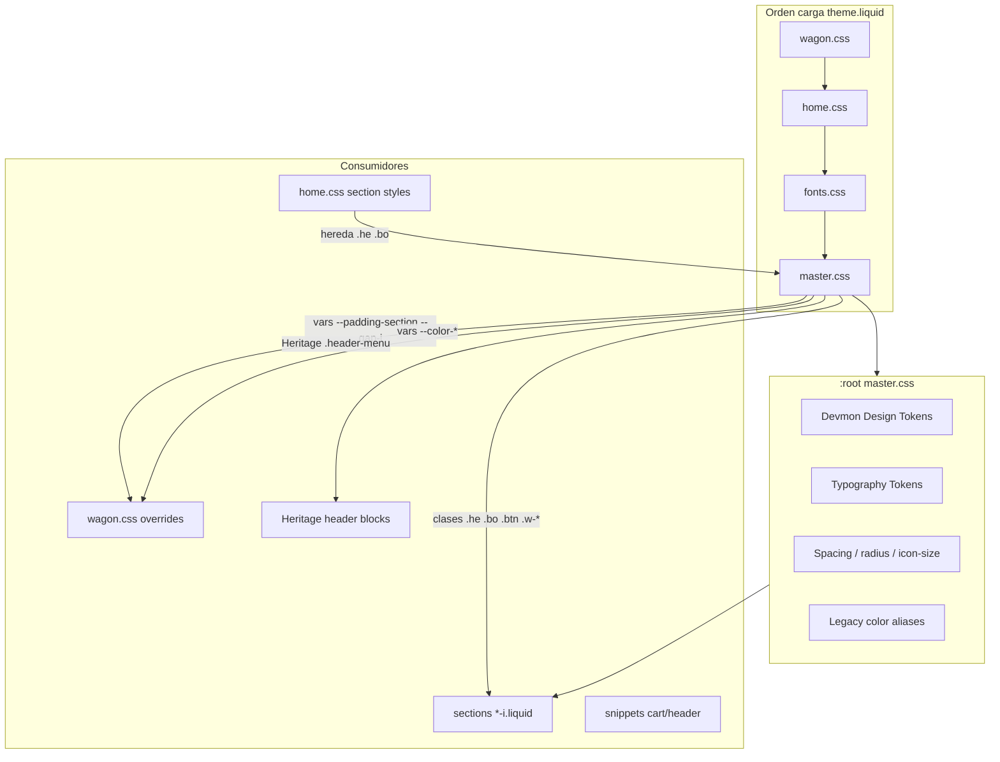

# Fase 3A — Arquitectura estructural de `master.css`

**Fecha:** 2026-07-03  
**Alcance:** Solo auditoría de `assets/master.css` (1.543 líneas). Cero modificaciones.  
**Objetivo:** Planificar la conversión de `master.css` en el núcleo oficial del Design System Devmon.

---

## Resumen ejecutivo

`master.css` es hoy un **monolito Wagon legacy** (~2016–2026) con dos capas superpuestas:

1. **Capa legacy (L1–1340):** sistema VW tipográfico Chocolat Uzma, componentes mezclados, 7 bloques `@media` casi idénticos (~850 líneas duplicadas).
2. **Capa moderna (L1344–1543):** utilidades de ancho 12 columnas + gap-aware, bien documentadas (mobile-first).

Los **Design Tokens Devmon v1** (colores + tipografía) ya viven en `:root` L11–77, pero comparten espacio con reset, PLP range slider, botones legacy y hacks Heritage header. **No hay** secciones dedicadas a cards, badges, grid formal, layers/z-index, print ni motion.

---

## 1. Índice completo del archivo

| Líneas | Sección actual | Contenido | Clasificación propuesta |
|--------|----------------|-----------|------------------------|
| **1–7** | Banner header | Comentario "GLOBAL SYSTEM", ref 1440px, codevamon | → Documentación / eliminar en v2 |
| **9–77** | `:root` global | Spacing, radius, icon-size, **Devmon color tokens**, **typography tokens**, legacy aliases | → **01 Design Tokens** |
| **79–99** | Reset parcial | `*`, `html/body`, `figure`, `a`, `ul`, headings margin | → **03 Layout / Reset** |
| **100–183** | PLP shopping | `.range-shopping-i`, `.sort-collapse/summary/list-shopping-i` | → **07 Components / Forms & Filters** |
| **186–242** | Typography classes | `.he-*`, `.bo-*`, `.sp-i`, `.code`, `.number-i` | → **02 Typography** |
| **243–245** | App integration | `.sealsubs-container:after` | → **11 Legacy** o eliminar |
| **247–281** | Links & overlay | `.link-i`, `.link`, `.linkhide-i` | → **07 Components / Links** |
| **282–369** | Buttons | `button` reset, `.btn-i/ii/iii`, variantes chocolat/tumeric/ivory/outline, icon hover | → **07 Components / Buttons** |
| **373–408** | Font weights | `.fw-thin` … `.fw-extrablack` | → **06 Utilities / Typography** |
| **410–424** | Layout utilities | `.w-100`, `.h-100`, `.flex-i`, flex alignment | → **06 Utilities / Layout** |
| **426–435** | Emoji stack | `.emojis` | → **08 Helpers** |
| **436–439** | Text utility | `.uppercase` | → **06 Utilities** |
| **441–450** | Forms/badges | `.field-wagon label`, `.tag-i` | → **07 Components** |
| **451–488** | Containers + Heritage hacks | `.container-i/ii/iii/fix`, `.header-menu nav a:after`, cart-icon, cart CTAs | → **04 Containers** + **11 Legacy Heritage** |
| **490–1340** | **BREAKPOINTS** | 7 `@media` con tipografía VW, containers, `:root` overrides, `.gap-*`, range thumbs, `.footer-i` order | → **02 Typography Responsive** + **10 Responsive** |
| **1344–1543** | **WIDTH UTILITIES** | `.w-1`…`.w-12`, responsive `.w-sm/md/lg/xl-*`, gap-aware `.flex-i > .w-*` | → **05 Grid / Width System** |

### Desglose BREAKPOINTS (L490–1340)

| Media query | Líneas aprox. | Rol |
|-------------|---------------|-----|
| `(min-width:1600px)` | 492–612 | XXL desktop — tipografía + tokens |
| `(1200px–1600px)` | 616–740 | XL |
| `(992px–1200px)` | 743–867 | LG |
| `(max-width:992px)` | 869–878 | Footer order hack only |
| `(768px–992px)` | 881–992 | MD |
| `(576px–768px)` | 996–1110 | SM |
| `(340px–576px)` | 1115–1226 | XS |
| `(max-width:340px)` | 1228–1338 | XXS |

Cada bloque (salvo L869–878) repite ~120–150 líneas: font-sizes, containers, `:root`, `.gap-i`…`.gap-x`, range thumb sizes.

---

## 2. Mapa de dependencias



### Dependencias críticas

| Token / clase | Definido en | Consumido por |
|---------------|-------------|---------------|
| `--padding-section`, `--padding-title` | `:root` en cada `@media` | `home.css`, `wagon.css`, sections `-i` |
| `--gap-i` … `--gap-iii` | `:root` global + media | `.flex-i`, `.link-i`, gap-aware grid |
| `.he-*`, `.bo-*` | master + font-size en media | Todas las sections Wagon, `home.css` |
| `.btn-i` + variantes | master | Footer, hero, PDP, cart |
| `.w-*`, `.w-md-*`, `.flex-i > .w-*` | master L1344+ | `foot.liquid`, `product-i`, `main-collection`, etc. |
| `.container-i` | master | Layout sections (implicit via structure) |
| `.range-shopping-i` | master | PLP `shopping-i`, `main-collection` |
| Legacy aliases `--color-chocolat` | master `:root` | **Solo botones master** — wagon/home ya usan tokens oficiales |

### Archivos que NO deben romperse al reorganizar

- `sections/*-i.liquid`, `sections/foot.liquid`, `sections/master.liquid`
- `assets/wagon.css`, `assets/home.css` (vars `--padding-*`, clases utilitarias)
- Heritage header (`.header-menu`, `cart-icon`)

---

## 3. Hallazgos — duplicados, obsoletos, hacks

### 3.1 Duplicación masiva (crítico)

| Patrón | Repeticiones | Líneas afectadas | Impacto |
|--------|--------------|------------------|---------|
| Bloque tipografía VW por breakpoint | **7×** | ~850 | Mantenimiento imposible; un cambio requiere 7 edits |
| `:root` override en media | **7×** | L564, 693, 819, 946, 1063, 1178, 1291 | Tokens spacing/padding duplicados; `--radius-v` varía sin documentar |
| `.gap-i` … `.gap-x` | **7×** | 10 clases × 7 media | `.gap-vii`–`.gap-x` **sin consumidor** en Liquid |
| Range thumb sizing | **7×** | Webkit + Moz por media | Podría ser custom props `--range-thumb-size` |
| Font-size blocks `.he-*`/`.bo-*` | **7×** | Idénticos en XL/LG, divergen en MD↓ | |

### 3.2 Dos sistemas responsive en conflicto

| Sistema | Enfoque | Breakpoints | Ubicación |
|---------|---------|-------------|-----------|
| **VW Typography** | Desktop-first ranges | 1600, 1200, 992, 768, 576, 340 | L490–1340 |
| **Width utilities** | Mobile-first min-width | 576, 768, 992, 1200 | L1344–1543 |

Bootstrap 5 (cargado en `theme.liquid`) añade un **tercer** sistema (`d-none`, grid BS). Documentar convención: Wagon layout = `.w-*` + `.flex-i`; tipografía = `.he-*`/`.bo-*`.

### 3.3 Variables / clases sospechosas

| Item | Evidencia | Veredicto |
|------|-----------|-----------|
| `--color-blanco` L465 | Usado en `.header-menu nav a:after`; **no definido** en `:root` | **Bug / huérfano** — migrar a `--color-white` |
| `--font-heading` | Definido L66; **0 usos** en master | Reservado — documentar |
| `--button-size-sm/md` | 24 refs solo en `:root` redeclarations | **Sin consumidor CSS** — candidato eliminar o cablear |
| `.gap-vii` … `.gap-x` | Solo en master.css | **Clases muertas** |
| `.footer-i` L869–878 | **0 usos** en Liquid; footer actual = `footer.foot` | **Obsoleto** |
| `.tag-i` | **0 usos** en templates; favorites usa `.tag-favorites-i` | **Candidato eliminar** o renombrar doc |
| `.link-iii` | Font-sizes en media; **0 usos** Liquid | **Muerto** |
| `.btn-iii` | Solo `sections/master.liquid` (demo) | **Casi muerto** |
| `.emails-i`, `.postcontent-i` | Font-sizes en media; sin sections activas `-i` | **Legacy blog/email** |
| `.menudrawer-rrss-i` | Solo CSS; verificar header drawer | Revisar antes de eliminar |
| `.sp-s`, `.sp-xs`, `.sp-xxs` | Font-size en MD↓; **sin font-family** en global | Incompleto vs `.sp-i` |
| `.sealsubs-container` | App third-party spacing | Legacy app |

### 3.4 Hacks y errores CSS

| Línea | Problema | Tipo |
|-------|----------|------|
| 296–301 | `.btn-i` declara `display:flex` **dos veces** | Duplicado |
| 557, 686, 812 | `.btn-iii{padding:vw 0.5vw…}` — valor **`vw` inválido** | **Bug** |
| 100–120 | Range slider hex `#FF791F`, `#F9EAD6` | Hardcode pre-Devmon |
| 135–142 | Thumb usa `--color-chocolat` (alias) no `--color-900` | Deuda nomenclatura |
| 465 | `--color-blanco` indefinido | Huérfano |
| 1436–1444 | `.flex-ii`, `.btn-icon-ii` dentro de bloque **WIDTH UTILITIES XL** | **Misplaced** — no son width utils |

### 3.5 Comentarios viejos

| Línea | Texto | Acción |
|-------|-------|--------|
| 1–6 | "GLOBAL SYSTEM", "Responsive VW Typography", "1440px" | Reemplazar por banner Devmon DS |
| 9 | `/* GLOBAL BASE */` | Renombrar secciones numeradas |
| 111, 130, 147 | Español mezclado Track/Thumb/Hover | Unificar EN o ES en doc interna |
| 489, 1340 | END GLOBAL / END BREAKPOINTS | Mantener hasta reorg |

### 3.6 Ausencias (no existen en master.css)

| Categoría solicitada | Estado |
|---------------------|--------|
| **Cards** | No hay `.card-*` base; cards viven en `home.css` / `wagon.css` |
| **Badges** | Solo `.tag-i` (muerto); badges en section-specific CSS |
| **Grid formal** | Solo width % utilities; no CSS Grid template |
| **Layers / z-index scale** | `--layer-*` en Heritage `theme-styles-variables`; master usa `z-index: 1` puntual |
| **Transitions** | Inline en `.btn-i`, `.link:after` — no tokens motion |
| **Animations / @keyframes** | **0** en master (motion en `wagon.css`) |
| **Print** | **0** `@media print` |

---

## 4. Estructura definitiva propuesta

```css
/* ==========================================================================
   Devmon Design System — master.css
   Version 1.x | Base viewport: 1440px
   ========================================================================== */

/* ==========================================================================
   01 Design Tokens
   ========================================================================== */
   /* 01.1 Color — brand scale + neutrals */
   /* 01.2 Color — legacy aliases (deprecation window) */
   /* 01.3 Typography — font stacks + aliases */
   /* 01.4 Spacing — gap, padding-section, padding-title */
   /* 01.5 Radius */
   /* 01.6 Icon sizes */
   /* 01.7 Motion — duration, easing (extract from components) */
   /* 01.8 Z-index — align with Heritage or bridge vars */

/* ==========================================================================
   02 Typography
   ========================================================================== */
   /* 02.1 Display / heading — .he-* */
   /* 02.2 Body — .bo-* */
   /* 02.3 Mono / special — .sp-i, .code, .number-i */
   /* 02.4 Font weights — .fw-* */
   /* 02.5 Responsive scale — SINGLE source via custom properties */

/* ==========================================================================
   03 Layout
   ========================================================================== */
   /* 03.1 Reset (minimal Wagon scope) */
   /* 03.2 Containers — .container-i/ii/iii/fix */

/* ==========================================================================
   04 Grid & Width System
   ========================================================================== */
   /* 04.1 Flex shell — .flex-i */
   /* 04.2 Width 12-col — .w-* + responsive */
   /* 04.3 Gap-aware — .flex-i > .w-* */
   /* 04.4 Gap utilities — .gap-i … .gap-vi (trim dead) */

/* ==========================================================================
   05 Utilities
   ========================================================================== */
   /* 05.1 Sizing — .w-100, .h-100, .fullsize */
   /* 05.2 Flex alignment */
   /* 05.3 Text — .uppercase */
   /* 05.4 Emoji stack */

/* ==========================================================================
   06 Components
   ========================================================================== */
   /* 06.1 Buttons — .btn-i/ii/iii + variants */
   /* 06.2 Links — .link-i, .link, .linkhide-i */
   /* 06.3 Forms — .field-wagon, .range-shopping-i, sort-* */
   /* 06.4 Tags — .tag-i (or deprecate) */

/* ==========================================================================
   07 Helpers
   ========================================================================== */
   /* 07.1 Third-party — .sealsubs-container */
   /* 07.2 Heritage bridge — header-menu underline, cart-icon */

/* ==========================================================================
   08 Motion
   ========================================================================== */
   /* 08.1 Transitions shared tokens */
   /* (keyframes stay in wagon.css until 3B) */

/* ==========================================================================
   09 Responsive
   ========================================================================== */
   /* 09.1 Token overrides per breakpoint — ONE block each var */
   /* 09.2 Typography scale — use clamp() or var(--text-he-xl) */
   /* 09.3 Component responsive tweaks */

/* ==========================================================================
   10 Legacy Compatibility
   ========================================================================== */
   /* 10.1 --color-chocolat aliases (sunset date TBD) */
   /* 10.2 .footer-i, .emails-i, .postcontent-i font rules */
   /* 10.3 btn-chocolat class names (rename in Phase 4) */
```

---

## 5. Propuesta de migración (sin mover código aún)

### Quedarse (núcleo Devmon)

| Bloque actual | Destino | Notas |
|---------------|---------|-------|
| L28–68 Tokens Devmon | 01 Design Tokens | Fuente de verdad |
| L186–242 Typography classes | 02 Typography | Mantener API `.he-*`/`.bo-*` |
| L287–369 Buttons | 06 Components | Renombrar variantes en fase futura |
| L410–424 Flex utilities | 04 Grid + 05 Utilities | |
| L451–456 Containers | 03 Layout | |
| L1344–1543 Width system | 04 Grid | Mejor documentado — modelo a seguir |
| L100–183 Range/sort PLP | 06 Components Forms | Migrar hex a tokens |

### Mover / dividir

| Bloque | Acción | Prioridad |
|--------|--------|-----------|
| L490–1340 Breakpoints | **Dividir:** token overrides → 09; font-sizes → 02.5; extraer a `custom properties` `--text-he-xl: 5.3vw` | **P0** |
| L869–878 `.footer-i` | Mover a 10 Legacy o **eliminar** tras verificar | P2 |
| L1436–1444 `.flex-ii`, `.btn-icon-ii` | Mover a 06 Components | P1 |
| L460–488 Heritage header | Mover a 07 Helpers / `wagon-bridge.css` futuro | P2 |
| L243–245 sealsubs | 07 Helpers | P3 |

### Eliminar (tras verificación QA)

| Item | Condición |
|------|-----------|
| `.gap-vii` … `.gap-x` | Confirmar 0 uso → eliminar |
| `.link-iii` font rules | 0 uso Liquid |
| `.tag-i` | 0 uso — o documentar para futuro badge |
| `.footer-i` order rules | Footer migrado a `foot.liquid` |
| `--button-size-*` | Si no se cablean en 3B |
| Banner L1–6 codevamon | Reemplazar por Devmon DS header |

### Documentar

| Tema | Contenido |
|------|-----------|
| Dual responsive systems | Cuándo usar `.w-md-6` vs Bootstrap vs VW type |
| Legacy aliases sunset | `--color-chocolat` en botones master → `--color-900` |
| `--padding-section` scale | Tabla por breakpoint |
| Clases demo | `sections/master.liquid` como styleguide |
| Heritage vs Wagon | Qué vive en master vs wagon vs home |

### Consolidar (técnica 3B)

**Antes (7 bloques):**
```css
@media (min-width:1600px) {
  .he-xl, .he-xl * { font-size: 5.3vw; }
  /* × 7 breakpoints */
}
```

**Después (propuesto):**
```css
:root {
  --text-he-xl: clamp(2rem, 5.3vw, 4.5rem);
}
.he-xl, .he-xl * { font-size: var(--text-he-xl); }
```

O tabla única por breakpoint solo para vars `--text-*`.

---

## 6. Roadmap de reorganización

| Fase | ID | Entregable | Riesgo | Esfuerzo |
|------|-----|------------|--------|----------|
| **3B** | Token cleanup | `--color-blanco` → `--color-white`; range hex → tokens; fix `padding:vw` | Bajo | S |
| **3C** | Section headers | Renumerar comentarios 01–10 sin mover reglas | Nulo | S |
| **3D** | Dedup breakpoints | Extraer `--text-*`, `--padding-*` por media; 7→1 typography source | Medio | L |
| **3E** | Grid unification | Documentar `.w-*` vs Bootstrap; mover `.flex-ii` | Bajo | S |
| **3F** | Dead code prune | `.gap-vii-x`, `.footer-i`, `.link-iii`, `.tag-i` | Medio | S |
| **3G** | Component split | Evaluar `master-components.css` vs single file | Medio | M |
| **3H** | Legacy sunset | Botones `btn-chocolat` → `btn-primary`; aliases color | Alto | L |
| **4A** | Motion tokens | Extraer easing/duration; link wagon keyframes | Medio | M |

### Orden recomendado

```
3B (fixes) → 3C (headers) → 3D (dedup) → 3E (grid doc) → 3F (prune) → 3G (optional split) → 3H (rename)
```

**Regla:** cada fase = 1 PR, grep verificación, QA homepage + PDP + PLP + cart.

---

## 7. Métricas del archivo

| Métrica | Valor |
|---------|-------|
| Líneas totales | **1.543** |
| Bloques `@media` | **12** (7 VW + 4 width + 1 footer) |
| Bloques `:root` | **8** (1 global + 7 responsive) |
| Clases únicas aprox. | ~120 |
| Duplicación estimada | **~55%** del bloque L490–1340 |
| Tokens Devmon color | 14 oficiales + 6 aliases |
| `@keyframes` / `print` | **0** |

---

## 8. Comandos de verificación (pre/post reorganización)

```bash
# Estructura actual
grep -n '^/\*' assets/master.css | head -30

# Duplicación :root en media
grep -n ':root{' assets/master.css

# Huérfanos
grep -n 'color-blanco\|padding:vw' assets/master.css

# Hex legacy
grep -nE '#[0-9A-Fa-f]{3,8}' assets/master.css

# Clases muertas — buscar en theme
rg '\bgap-vii\b|\bgap-viii\b|\bfooter-i\b|\btag-i\b|\blink-iii\b' --glob '*.liquid'
rg '\bbtn-iii\b' --glob '*.liquid'

# Consumo core classes
rg '\bhe-xl\b|\bbo-m\b|\bbtn-i\b|\bflex-i\b|\bw-md-' --glob '*.liquid' | wc -l

# Dependencia padding vars
rg 'padding-section|padding-title' assets/ sections/
```

---

## Fuera de alcance (esta fase)

- Modificar `master.css`, `wagon.css`, `home.css`
- Split físico en múltiples archivos
- Commit

---

## Referencias cruzadas

| Documento | Relación |
|-----------|----------|
| `handoff/12-phase2c2-design-tokens-report.md` | Tokens en `:root` |
| `handoff/18-phase2c5c-wagon-color-token-migration-report.md` | wagon migrado |
| `handoff/19-phase2c6-home-color-migration-report.md` | home migrado |
| `handoff/09-phase2c1-visual-system-audit.md` | Dual Heritage/Wagon |

---

**Estado:** Auditoría completa. Sin modificaciones de código. Sin commit.
